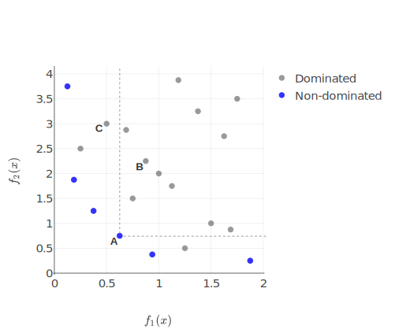
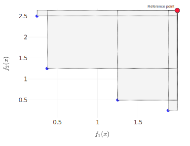
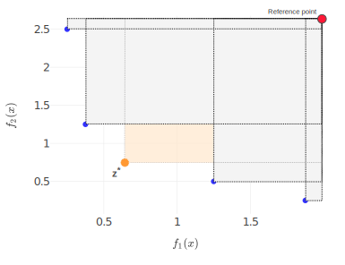

Background {.page_break_before #sec:background}
==========

This chapter presents general background information needed to follow
the terms and methods used in this thesis.

Parameter tuning
----------------

We start by introducing a parameter tuning problem. We consider a
objective function as a black-box
$f : \mathbb{S} \rightarrow \mathbb{R}$ with parameter and objective
spaces (Figure {@fig:spaces}). All feasible combinations of parameters
define a parameter space which is intended to be a function input
$\mathbb{S}$, and therefore all possible function outputs are defined as
an objective space or $f(x), x \in \mathbb{S}$. The minimization of the
fitness function could be defined as follows:

$$\label{eq:arg_min}
                    x^* = \underset{x \in \mathbb{S}}{\arg\min} f(x)$$

{#fig:spaces width=100%} 

The mapping of all points from the parameter space to the points in the
objective space is called a fitness landscape. The goal of parameter
tuning is to find optimal points on this surface. Depending on the type
of landscape, the optimization search often yields qualitatively
different behaviour. A single criterion in the parameter tuning process
might not be sufficient to characterize the behaviour of the
configuration space correctly. Therefore, multiple criteria have to be
considered. Typical examples of objectives are to enhance accuracy and
performance or minimize runtime, error rate and energy. The parameter
tuning process should improve the objectives of those in which none of
the objectives can be improved without affecting another objective. By
default, we consider minimization for all objectives. In this thesis, we
are interested in the following properties of parameter tuning:

-   Evaluation is expensive.

-   Black-box function and the number of evaluated results are unknown.

-   Multi-objectivity with global minimization.

Multi-objective optimization
----------------------------

Common parameter tuning problems require the simultaneous optimization
of multiple, usually contradictory, objectives
$f = (f_1(x), \ldots, f_k(x))$. Multi-objective optimization deals with
such conflicts. It provides a mathematical algorithm with which to
obtain an optimal design state that accommodates the various criteria
demanded by the situation. Objectives are being improved simultaneously
and gradually.

The solution to the multi-objective problem is a group of points which
are placed on a Pareto front; i.e. the subset of solutions which are not
worse than any other and better at least one goal [@raw:KrallMD15]. A
solution is called a Pareto optimum if no other solution dominates it.
For example (Figure {@fig:dominated}) a solution $A \in \mathbb{S}$ is said to dominate another solution $B \in \mathbb{S}$ , denoted $A \preceq B$ if $f_i(A)<=f_i(B)$ for all $i=1, \ldots ,k$ and $f_i(A)<f_i(B)$ for at least one $i \in \{1, \ldots k\}$. All points on the Pareto frontier are not dominated by any other point in the objective space [@raw:Kaisa0021267].

Awareness of the Pareto front allows appropriate decision-making and the
importance of the criteria to be visualized. For the multi-objective
problem, we consider the solution as points from the parameter space
which lead to non-dominated results in the objective space. Improvement
of the solution means finding a set of points that corresponds better
with the real Pareto front.

{#fig:dominated width=100%}

### Metrics for multi-objective solution

In a single-objective optimization, the quality of a given solution is
trivial to quantify. When we consider a solution of a multi-objective
problem as a Pareto optimal approximation, the comparison of these
solutions is also a multi-objective task. The question of picking
metrics for evaluation is essential for comparison of approximated
solutions and for selection of the next appropriate set of
configurations.

According to [@raw:ZitzlerDT00], a Pareto front approximation should satisfy
the following criteria:

-   The distance between the Pareto front and its approximation should
    be minimized.

-   A wide distribution of non-dominated points is desirable.

-   The range of the approximated front should be maximized, i.e., for
    each objective, a wide range of values should be covered by the
    non-dominated points.

The metrics for performance indicators are partitioned into four groups
according to their properties [@raw:Audet2018PerformanceII]:

-   *Cardinality.* Estimation of the number of non-dominated points.

-   *Convergence.* Estimation of the closeness of a set of non-dominated
    points to the Pareto front in the objective space.

-   *Distribution and spread indicators.* Measurement of the points
    distributed on the Pareto front approximation or of their allotment
    in extreme points of the Pareto front.

-   *Convergence and distribution indicators.* Capture of both the
    properties of convergence and distribution.

According to [@raw:CustodioMVV11], the spread metrics try to measure the
areas achieved in a computed Pareto front approximation. This type of
metrics is not very useful for comparison of algorithms or for
evaluation of optimization convergence because spreadness is not related
to improvement the objectives. However, they could be useful for a more
detailed analysis of the optimization process or for composing Pareto
frontier from several solutions.

The goal of the multi-objective optimization is to obtain an
approximated solution set with the reference to the Pareto front,
including the following subgoals:

-   All solution sets are as close as possible to the Pareto front.

-   All solution sets are as diverse as possible in the objective space.

-   The proportion of the solution set to the evaluated set is as large
    as possible.

-   Evaluate as few solutions as feasible.

For multi-objective optimization, an algorithm should produce a set of
solutions which provide the optimal trade-off between the considered
optimization objectives. Therefore, the performance comparison of Multi-objective optimization
algorithms is based on their Pareto sets. In this study, four well-known
metrics are used to quantify the performance of algorithms.

-   **Hypervolume (HV).**[@raw:ZitzlerDT00] *Convergence and distribution
    indicator.* This metric represents the volume of the objective space
    which is filled by the individuals points of non-dominated solutions
    which belong to the Pareto front (Figure {@fig:hypervolume} {@fig:hypervolume_impr}). Two
    points delimit the volume: one point represents the reference point
    $r$ ($r \in R^m$) which is defined as the worst solution inside the
    objective spaceand the other one is the point which represents the
    Pareto approximation $S$, for all $z \in S, z \prec r$. The
    hypervolume metric is defined as follows:

    $$HV(S,r) = \lambda_m(\bigcup\limits_{z \in S} [z;r])$$

    where $\lambda_m$ is m-dimensional Lebesgue measure. Calculating the
    hypervolume indicator is a computationally expensive task.
    Furthermore, in the case of a small number of dimensions and a low
    number of points, there are currently no known algorithms which
    might return the results fast enough for use due to the
    computational complexity which is
    $\mathcal{O}(|S|^{\frac{m}{2}}\log{|S|}) $ [@raw:BeumeFLPV09].

-   **Non-dominated Ratio (NDR).** *Cardinality.* This metric is the
    ratio between the number of non-dominated points and the total
    number of the evaluated points. Higher values are preferred to lower
    ones.

-   **Spacing [@raw:Schott1995FaultTD].** *Distribution and spread.* This
    metric describe the distribution of Pareto points. As a wide range
    of similar metrics which are based on the distance to the nearest
    neighbour, spacing does not cover the holes in Pareto frontier and
    might compute the distribution in solution clusters.

-   **$\Upsilon$-metric (p-distance)**[@raw:Martens13] *Convergence* The
    average distance of a set of points in relation to the Pareto front.
    $\Upsilon$-metric is defined by

    $$\Upsilon(S) = \frac{1}{|S|}\sum_{z\in S}g(z)-g(x^*)$$ where $g$ is
    a distance function and $x^*$ is the Pareto-optimal decision vector.
    The lower the $\Upsilon (S)$, the closer the solutions of S are to
    the solutions of the Pareto front.

{#fig:hypervolume width=85%}

{#fig:hypervolume_impr width=85%}

### Solving methods

Finding a Pareto optimal set is often impractical and computationally
expensive. Therefore, many stochastic search strategies have been
developed, such as: evolutionary algorithms, tabu search, simulated
annealing and ant colony optimization. These algorithms usually do not
ensure finding ideal trade-offs, but try to gain a satisfactory
approximation. In this thesis, we interpret the Pareto optimum as the
optimal solution to the problem. As mentioned, all points on the Pareto
front are non-dominated, but not all non-dominated points are Pareto
optimal. There are several basic approaches which provide information
about how non-dominated points move toward a Pareto-optimal solution.
Those approaches include: scalarization and Multi-objective evolutionary algorithm (MOEA). We describe them in next
the sections.

#### Scalarization

The Scalarizing approach is a popular technique for creating a
single-objective *parameterized* problem with the composite criteria
from multiple objectives. The main advantage of scalarization is the
possibility to use a broad range of single-objective techniques on this
composite function. After optimization, one Pareto optimal solution is
obtained, which depends on the initial scalarization parameters. The
weighted-sum method is a well-known type of scalarizing technique. This
approach concatenates the objectives into a single criterion by using
weighted sum factors. There are difficulties in selecting proper
weights, especially when there is no correlation in prior knowledge
among objectives [@raw:ChughScal2019; @raw:DerbelBLV14].

Some scalarizing techniques try to improve the exploration of the
parameter space by assigning more “intelligent” aggregation to
objectives. Such solutions can be fragile; they change dramatically with
the modification of algorithm parameters. Moreover, the weighting method
cannot provide a solution among underparts of the Pareto surface due to
the “duality gap” for non-convex cases. This refers to the replacement
of a non-convex original function with convex closure which missed
non-convex parts of the initial landscape. Additionally, some
scalarizing algorithms are very sensitive to the number of objectives.
Analysis of the fitness landscape with different scalarizing techniques
might be helpful in the optimization for solving expensive
[@raw:ChughScal2019].

#### Multi-Objective Evolutionary Algorithms

Evolutionary algorithms form a class of heuristic search methods which
simulate the process of a natural evolution. The evolutionary algorithm
is determined by the two basic principles: selection and variation
[@raw:TutMOEABrockhoff]. While selection reflects competition for
reproduction and resources among individuals, the other principle,
variation, imitates the natural ability to produce new individuals
through recombination and mutation. Evolutionary algorithms are suitable
for several problems, including multiple conflicting objectives and
large and complicated search spaces [@raw:Andersson00asurvey; @raw:RamirezRV19].
Evolutionary optimizers explore populations of candidate solutions in
each generation. Mutators can make changes to the current population. A
select operator then picks the best mutants, which are then combined in
some way to become a new population in the next iteration. However, Evolutionary algorithm (EA)
still needs many evaluations of the black box system to solve the common
multi-objective problem. This problem is crucial for the reason that
most multi-criteria problems are expensive to estimate. This massive
evaluation budget makes EAs infeasible for costly and multi-objective
problems.

Surrogate optimization
----------------------

Many expensive optimization problems have practical limitation on the
number of possible estimations which standard optimization approaches
spend very quickly. To get around this drawback, approximation models or
surrogate models are often used. This technique is essential to reduce
real evaluations by building a regression function based on already
evaluated design points. The potential of the application of surrogates
is based on the generalization of the entire search space and fast
navigations there. This advantage should overrule the disadvantage in
time required to build this approximation. In classical model-based
optimization, a single surrogate model provides a hypothesis on the
relation between the parameter and objective spaces. The approximation
of the solution becomes faster than the real evaluation, so the whole
optimization process is accelerated. However, some extra time is needed
to build and update the surrogate model during the optimization process.
The surrogate model is used to find probable good candidates or to drop
the low-quality individuals even before they are exactly evaluated,
thereby reducing the number of exact evaluations.

In the literature, the term surrogate or model-based optimization is
used in cases when, during the optimization process, some solutions are
not evaluated with the original function but rather are approximated
using a model of this function. Some of the most commonly used methods
are the Response Surface Method [@raw:ResponseSurface], Radial Basis
Function [@raw:Rasmussen2004], Neural Network [@raw:KOURAKOS201313], Kriging
[@raw:Woodard00], and Gaussian Process Modeling
[@raw:RasmussenN10; @raw:RasmussenW06]. Surrogates are also used to rank and
filter out the offspring according to Pareto-related indicators like a
hypervolume [@raw:EmmerichGN06], or a weighted sum of the objectives
[@raw:TaboadaBCW07]. If the model is a single-criterion, it could be
expanded to a multi-objective surrogate by considering each criterion in
isolation and duplicating the model for each of them
[@raw:Knowles06; @raw:nardi2019practical]. The surrogate model is either
selected randomly or due to its popularity in the associated domain area
[@raw:SoftSurvey]. Thus, there are still some open challenges related to the
combination of meta-models, such as a definition of a selection
criterion or combination techniques. Besides, there are no guidelines
for using heterogeneous compositional models for different objective
functions [@raw:SoftSurvey].

#### Multi-objective parameter tuning

The categorization of parameter tuning approaches based on the workflow
of sequential model-based optimization is presented in Figure
{@fig:mo_param_tuning}. The optimization process begins with an
initial sampling plan. At this stage, it is necessary to collect fitness
results or to evaluate the first parameters which are used to build
surrogate models. For an initial sampling plan, or a Design of Experiments plan, the
techniques of Latin hypercube sampling, Sobol sampling or random sampling can be used.

{#fig:mo_param_tuning width=100%}

There are two established approaches to extrapolate the samples: 1) to
scalarize objectives and produce a surrogate model of this scalarization
(In this case, the multi-objective problem transforms into a
single-objective one); 2) to keep the original dimensionality of the
problem and apply one or several models to hold and infer on the problem
landscape.

The next step, optimization, is the search for optimal points within the
surrogate model. At this step, the solutions which might be
Pareto-optimal are found. In predict configurations phase, sorting and
selection are carried out. In the case of multi-criteria selection, it
is necessary to select the required number of points which are optimal
for all objectives. Theoretically, all non-dominated points are equal
regardless of the order they are chosen in. The possible prediction of
several parameters instead of a single one is an advantage that improves
the exploration of the parameter space and parallelizing of fitness
evaluation. The required number of points allows the sample set to be
estimated as well as updated. Optimization iterations continue until a
stop condition is satisfied.

Variability and extensibility are essential for configurable parameter
tuning, as in a software product line. To this effect, the optimization
round is consistent and universal. As shown in Figure
{@fig:mo_param_tuning}, the potential to reuse components in a
workflow is enormous. The same single-objective models can be equally
applied to various types of problems in multi-/single-objective
optimization. An optimization algorithm weakly depends on the type of
surrogate model. By dynamic duplication of the surrogate model or even
by the creation of several surrogate hypotheses, we aim to improve the
parameter tuning to multiply criteria on-the-fly.

### Domain-specific problem

Surrogate models are domain-specific in case of intention to find the
best solution with less effort. On the one hand, the surrogate model
could perform well while extrapolation one class of problems and guide
to the optimal solution. On the other hand, this model could be a reason
for a significantly degrading result in another type of problem. That is
why the authors prefer using several surrogate models and don’t select
one for all use cases [@raw:SoftSurvey].

It could be an interpreted as a Non-Free-Lunch theorem in model-based optimization. If we
extend this argument, then the same optimization problem in different
parameter tuning iteration could be interpreted as another optimization
problem. In order to reduce an effort and to increase the convergence of
an algorithm, we should change the surrogate model depending on how many
samples we have. This leads us to the usage of a portfolio with
surrogate models. On each optimization iteration, the portfolio tries to
build and select several models with the best performance. As a negative
consequence, building several models introduces an additional overhead
into the optimization time.

### Initial sampling set

Initial samples should provide maximal information to build a useful
surrogate model. Indeed, the overall result of the optimization depends
primarily on how accurate the initial assumption is; an invalid
optimization model makes all further optimization results irrelevant.
The concept of surrogate validity guarantees that the model can
confidently be used to find optimal solutions.

If no valid models are obtained, it is better to use the initial design
than to be guided by an incorrect model. With an increasing sample size,
in case of proper fitting, a better surrogate model is obtained, and the
better results in optimization are reached. Moreover, the initial sample
size might be too big, which is a mere waste of resources.

Discussion
----------

Most methods for parameter tuning optimization are related to
surrogate-based optimization. One of the main advantages of this
approach is the speed of evaluation across the entire search space and
possibilities to apply a broad range of optimization techniques.
However, there are also disadvantages, such as the extra time required
to select and build this surrogate model. It would be desirable to have
a way to combine several surrogate models which are sample- and
domain-dependent.
