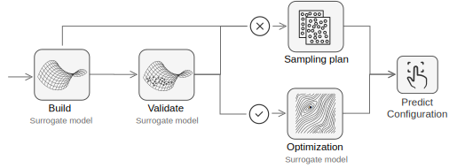
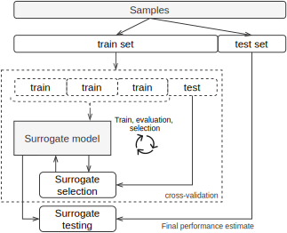

Compositional Surrogate {#sec:concept}
=======================

This chapter introduces a general idea which overcomes the limitations
of model-based optimization discussed.

As mentioned previously in section @{sec:background}, fixed components
can make the optimization process ineffective. That is why flexibility
and variability must be introduced for each optimization step. Our
concept focuses on the combination of surrogate models to effectively
extrapolation required problems.

Combinations of surrogate models
--------------------------------

Let us address the main issue we have observed in multi-objective
optimization. The issue is that the solution techniques and parametric
selections are usually problem-specific. In addition to that, most
surrogate model implementations are static which imposes limitations on
existing solutions. We tackle this challenge by improving model
variability *in* a surrogate model (compositional surrogate) and model
extensibility *with* surrogate hypotheses (surrogate portfolio). Also,
we should address an additional question of solution scalability, which
is related to the compositional surrogate model. There are some tasks
that could require new algorithmic approaches when we add more
parameters to them. Therefore, there exists a demand for scalable
solutions. We discuss our approach to problems described i+n the next
sections.

### Compositional Surrogate Model \[RQ1\]

The concept of the compositional surrogate is the combination of
multiple simple models to approximate several independent objectives at
the same time. In this model, composite and conventional surrogates have
a unified interface that permits us to implement a *composite design
pattern*[@raw:bookGOF]. This design pattern then allows us to operate
uniformly with the individual and multi-objective surrogates.

Additionally, a significant advantage of compositional surrogates is a
possibility to extend single-objective parameter tuning to
multi-objective optimization. This possibility provides the opportunity
to reuse single-criterion models for multi-criteria optimization and
dynamically reconstruct problem representation from mixed parts. We
define *compositional models* as models that combine *various* sub
surrogate models for each optimization objective. The *surrogate
hypothesis* refinement is also used to emphasize that the surrogate
model can completely describe all criteria from the objective space.

The compositional surrogate has multiple opportunities for variability
that outperform static models in the face of real black-box problems.
For example, choosing a specific set of models is a representation of
knowledge about the subject area. If expectations during optimization
are not met, the compositional model can be partially updated, which
saves time. In contrast, a static model would need to be completely
replaced. Such changes might be demanded by newly obtained results or
the increased dimensionality of optimization space.

#### Scalability

The ability to scale the optimization solution can be considered an
adaptation to an unknown problem. Solution scalability is the ability to
solve problems with a high number of dimensions in parameters and
objectives spaces.

Multiple works[@raw:KrallMD15; @raw:SpringenbergKFH16] have practically
demonstrated that scalability is a problem for surrogate models and
optimization algorithms. As an illustration, popular surrogate models
such as Gaussian process regression (Kriging) [@raw:JonesSW98] struggle with
high dimensional samples but provide excellent results in smaller
dimensions. Therefore, another advantage of the composite surrogate
model is evident; it provides variability for the extrapolation of
scalable search space.

### Surrogate model portfolio \[RQ2\]

In addition to the dynamic variability in the compositional surrogate,
we combine several surrogate hypotheses in a surrogate portfolio to
dynamically choose one that is best suited to the specific problem. The
unified interface and the ability to integrate models into a composite
architecture make it possible to uniquely select and combine composite
models side by side with static multi-objective models.

Without information about a given problem, it is difficult to say which
surrogate hypothesis would be better. Therefore, the model should be
selected during optimization based on its usefulness (validity). The
validation process involves checking how well the model extrapolates
unknown data. For such validation evidence, a small portion of samples
should be sacrificed. This process of data sacrifice give us two
separate data sets: one for model building and another for its testing.
The test score obtained from the test set is used to evaluate the
model’s accuracy and, accordingly, the quality of the possible
corresponding solutions. The validation process allows us to evaluate
surrogate models based on how they summarize an unknown problem.

For an optimization algorithm, a portfolio can be considered either as a
single model or as a collection of models. This property allows us to
determine which optimization algorithms are applied to which surrogate
models and how to combine such solutions. Such dynamic variability makes
the multi-criteria optimization process also scalable and flexible.

Besides, the surrogate portfolio does not limit to use the latest
state-of-the-art optimization algorithms and surrogate models together.

Sampling plan \[RQ3\]
---------------------

After surveying the aforementioned related works, we learned that only
BRISE use dynamic sampling plan while other approaches use a static
sampling plan that determines an optimal number of initial samples using
an outside oracle. On the contrary, BRISE is applied dynamic but still
domain-dependant sampling plan. Although in most cases, we cannot
receive any guidance on an unknown problem. Thus, we need a dynamic
sampling plan which adapts to a specific use-case.

To obtain the adaptive sampling size we need to bind the sampling design
to a validation process for the surrogate model. An optimization process
is guided by sampling design when none of the surrogate models are valid
(Figure {@fig:concept_sampling}). Validity means that the surrogate
approximation can be useful for efficient global optimization.

{#fig:concept_sampling width=100%}

### Surrogate Validation

In the context of sequential model-based optimization, a common mistake
is studying the accuracy of the evaluation of the global search space
instead of the search space region of interest. That is why basing the
evaluation of surrogate validity only on the coefficient of
determination(R2) is incorrect [@raw:nardi2019practical]. The global
accuracy metric can be used as a threshold value above which the model
becomes invalid even with additional estimations.

It is necessary to sacrifice a small portion of samples to check the
surrogate model’s quality. Based on validation results, we can discard
inadequate models and consider the solutions from valid models only. If
none of the models are valid, the best decision is to now make a
prediction from the sampling plan. This decision is repeated until a
valid surrogate model is obtained.

Validation should show how well the model extrapolates the available
experiments (variance) and how well it can evaluate the data that is not
seen (bias). The central concept in surrogate validation lies in the
adaptation of the best machine-learning approaches for the evaluation of
a model’s performance.

We select surrogate models based on accuracy in the test set, but the
selection may not be correct if only one test set is taken into account.
Increasing surrogate complexity can lead to obtaining wrong conclusions
in a later stage of optimization (Figure {@fig:cv_overfitting}). This
property cannot be neglected in evaluating a surrogate’s validity.

![With rising model complexity overfitting on the training set becomes more likely [@raw:HastieFT01; @raw:TobiasCV]](images/utility/cv_2x_test.svg){#fig:cv_overfitting width=100mm}

It is necessary to perform the validation in a few phases with separate
test sets. The validation process requires two separate test sets: the
first one to select surrogate models and the second one to test those
selected models. In addition to those two test sets there is a third set
for building surrogate models. We obtain those sets by dividing all
available samples.

Partitioning the available samples into three sets drastically reduces
the number of points that can be used for building the model. A small
number of build samples could lead to inadequacy of the model.
Also, results can depend on the selective random decision for sample
splitting.

However, partitioning the available samples into three sets, are
drastically reduce the number of points which can be used for learning
the model. Moreover, results can depend on a selective random decision
for the samples splitting. The solution is might be cross-validation(CV,
Figure {@fig:cv}). This is a procedure that avoids a separate
validation set and divides test samples to *k* equal folds. Set of folds
are used to train model and in *k* rounds, a new fold selected as a test
set. The performance measured by cross-validation is the averaged over
the values computed in the loop. This approach can be computationally
expensive but requires fewer samples.

{#fig:cv width=100%}

To summarize, the model validation is performed in two stages:

1.  **Cross-validation.** We check overall accuracy of the surrogate
    model extrapolation. Also, we discard models that do not achieve the
    necessary threshold.

2.  **Surrogate testing.** We demonstrate the accuracy of the selected
    models and the corresponding assessment of possible solutions.

We decide which surrogate models to choose based on the information from
all stages. If the model does not achieve a sufficient threshold, it is
rejected as not valid. If there is no valid model, the assumption about
the next configuration is accepted from the sampling plan (Figure
{@fig:concept_sampling}).

Discussion
----------

Toward answering our research questions, we propose the dynamic
combination of surrogate models and a dynamic sampling plan based on
surrogate validation.

-   **RQ1:** For the dynamic combination of several surrogate models, it
    is necessary to implement a surrogate compositional model. This
    design allows uniform handling of individual and compositional
    surrogate models.

-   **RQ2:** The combination of surrogate models in the portfolio is
    realized through the compositional model and stepwise validation.

-   **RQ3:** The sampling plan is chosen to explore new random points
    when there is no valid model. This relation means that the sampling
    plan directly depends on whether we have a surrogate model that is
    capable of describing the optimization problem.

As a result, we extend the idea of classic SMBO using dynamic model selection
and stepwise validation to obtain a multi-objective solution on various
problem landscapes.
