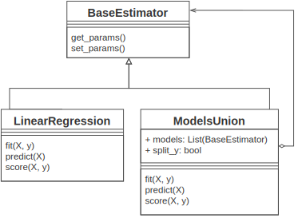
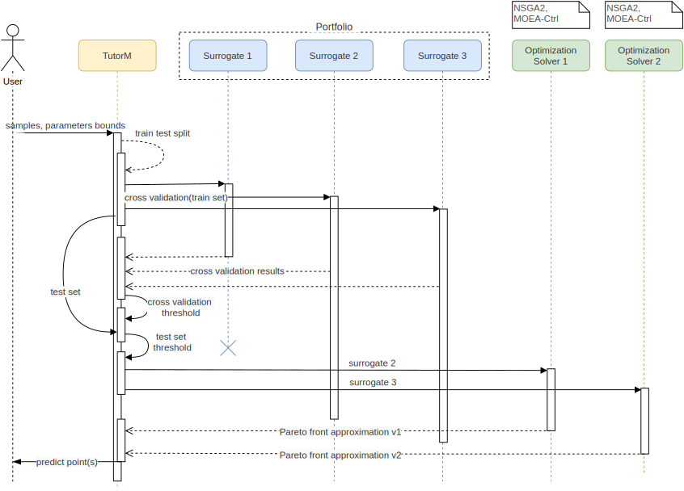
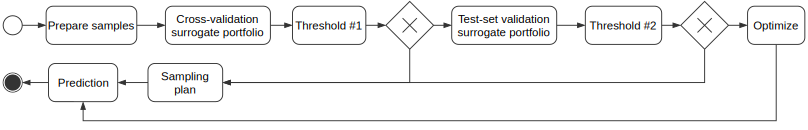

Implementation
==============

In this chapter, we present the implementation details of our proposed
decisions.

In order to achieve goals from previous sections, it is necessary
to formulate technical requirements for implementation. After a thorough
study of the literature [@raw:buitinck2013api], we put forward the following
requirements:

-   **Components.** To meet the needs of flexible architecture, we need
    to divide the optimization workflow into logical steps and abstract
    them. These abstractions are interpreted as easily replaceable
    components. Only in the case of homogeneity of optimization
    processes with the standard interfaces, it is possible to scale the
    optimization approach to multi-objective tasks.

-   **Separation of concerns.** In order to ensure more considerable
    optimization variability, it is necessary to evaluate the
    optimization steps independently.

-   **Non-proliferation of classes.** To improve the compatibility of
    our solution with other frameworks, we need to use a simple
    structure to share information.

The following frameworks were used to fulfill the criteria.

**Scikit-learn** [@raw:art-scikit-learn] is one of the most popular machine
learning framework that accomplishes with a variety of learning tasks.
The crucial features are excellent documentation and reusable components
in various contexts. Extensibility and consistent interfaces resulted in
large and active community of library. Scikit-learn integrates well with
many other Python libraries.

**pygmo2** [@raw:francesco_biscani_2019] is scientific library with an
effective parallelization for local and global optimization. Key
features of this project are efficient implementations of bio-inspired
and evolutionary algorithms and unified interface to optimization
algorithms and problem definitions.

Next, specific optimization steps will be discussed.

Compositional surrogate
-----------------------

The Composite Surrogate provides the ability to aggregate several simple
models to promote multi-objective extrapolation.

To achieve this goal, the Model-union class (Figure {@fig:munion})
class was implemented. It is implement *a compositional design pattern*
[@raw:bookGOF] where several heterogeneous models could be combined. This
class is as meta-model that wraps and aggregate surrogates and could be
combined in a tree structure. Such an architectural solution is needed
to improve the scalability of surrogates as components

A parent class that combines multiple models can combine their
approximations in several ways:

-   **Stacking.** It is an ensemble approximation technique which
    average obtain results from each child model. The child regression
    models are trained based on the whole training samples.

-   **Split y.** A straightforward technique to combine several
    regression models in multi-label prediction case. Each child
    surrogate is trained on the entire dataset, including only one
    objective of interest. This functionality allows as to produce
    multi-objective compositional surrogate from combinations of
    single-objective models.

{#fig:munion width=100%}

So, Model-union class puts the compositional model on one line with
other surrogate models. It allows us to independently validate many
surrogate models and combine them in a surrogate portfolio.

Optimization orchestrator
-------------------------

The *TutorModel* (TutotM) Class is the orchestrator of all optimization
steps. TutorM is responsible for parallel surrogate build, their
validation and combination. Also, TutorM provides surrogate models to
the optimization algorithm. Due to the principle of separation of
concerns, the surrogate model does no depend on the optimization
technique. As a result, this extensive combination can provide
additional flexibility and the ability to adapt to specific problems. An
example of the workflow of TutorModel is presented in the Figure
{@fig:tutor_activity}, As can we note, there are three surrogate
models in the portfolio, from which pass validation only two.

Validation is the primary source of information for deciding on a
surrogate model.

{#fig:tutor_activity width=100%}

##### Surrogates validation

To select a surrogate model, we need to check the accuracy of the
assumption from unknown experiments(test set). As mentioned in previous
Chapter, validation should be done in several stages to
avoid overfitting (Figure {@fig:simsim_activity_validation}). The
validation steps are as follows: At the first stage, models are selected
based on *cross validation* technique. In this stage define lower bound
for overall accuracy. We notice that pass this threshold does not
guarantee that surrogate is useful. 2) On the last stage, valid models
from the previous stage are evaluated and selected for optimization.

{#fig:simsim_activity_validation width=100%}

##### Optimization algorithm

The role of the optimization algorithm is to find a near-optimal
solution based on surrogate approximation. While other methods also
exist, we select as the main solver because it can be applied to a wide
range of problems.

Optimization framework requires the definition of custom problems. The
optimization problem is not built on top of surrogate models, but are
used with the help of surrogate models. In the case of the genetic
algorithm, it produces the population of parameters, that could be
treated as a Pareto front approximation. If several surrogates are valid
than several Pareto front approximations obtain. There are two
approaches to select the most informative solutions: 1) pick Pareto
approximation from surrogate with the highest accuracy in non-dominated
points. 2) Assume that all approximations are valid and all points could
be selected. In this case, intersection predictions from samples have a
higher probability of being selected.

##### Surrogate portfolio

Since the surrogate model can produce different results on a different
problem, it is necessary to choose a model from the portfolio.

Surrogate models can be divided into two groups: a multi-output model
for all objectives and compositional model with single-output models.
All models pass validation equally, but after cross-validation
single-objective models should combine with another one to provide
multi-objective surrogate hypothesis. During this process, all
objectives should be restored from valid surrogates.

Conclusion
----------

We implemented a base class that can deal with a composite surrogate
model and can combine arbitrary model to apply for a multi-criteria
problem. The TutorM class is required to bring together implemented
features such as surrogate portfolio, validation strategy and dynamic
compositional model. Also, the requirements for the implementation of
the proposed strategy have been identified. Mentioned requirements are
intended to improve the further support and benefits of the developed
method.
