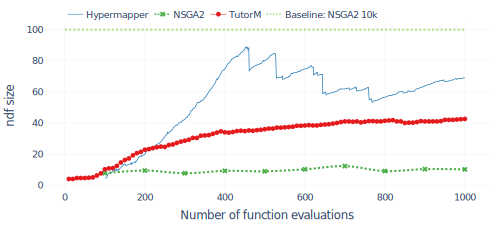
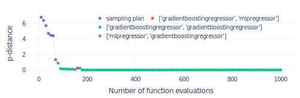
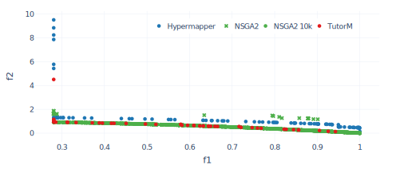
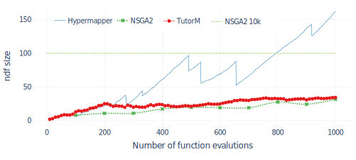
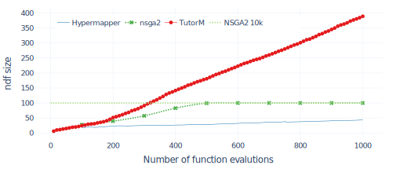
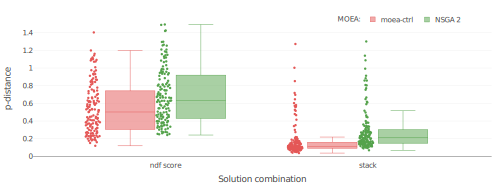
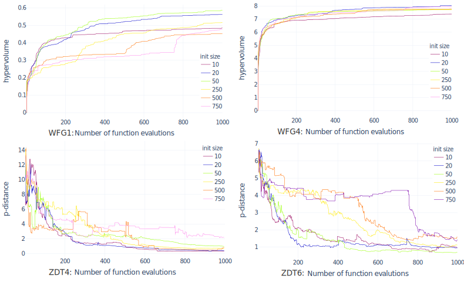
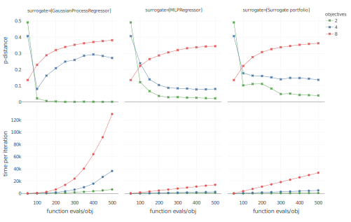

Evaluation
==========

In this chapter, we present the results obtained from our approach.
Additionally, we compare the developed approach with state-of-the-art
strategies: evolutionary algorithms and static compound model-based
optimization.

Experimental setup
------------------

We will begin by introducing a description of the selected optimization
problems and applicable approaches for their analysis. Those problems
include ZDT, DTLZ and WFG problems suits.

### Optimization problems

Different optimization approaches need to applied to the numerous types
of optimization problems to reduce the comparison bias in the obtained
results (direct consequence of the No-free-Lunch theorem). To that mean, we select several
comprehensive synthetic benchmark suites for comparison. They are all
scalable in the parameter space and some are scalable in the objective
space. The problems are designed so that a meaningful comparison can be
obtained for optimization techniques. All cases are minimization
problems.

According to [@raw:WFGref], the following properties characterize the
optimization problems:

-   *Modality* is a property of the objective surface. Test problems are
    either unimodal, with one global optimum, or multimodal, with
    several local optima. Multimodal problems are more complicated than
    unimodal ones and bear more resemblance with real-world scenarios
    (Figure {@fig:intro_mult_bias}). Deceptive objective functions
    have a special kind of multimodality that has at least two optima —
    a true optimum and a deceptive optimum — but the majority of the
    search space favors the deceptive optimum [@raw:Deb99].

-   A *geometry* of the Pareto optimal front can be convex, linear,
    concave, mixed, degenerate, disconnected, or some combination of the
    former. It directly influences the algorithm’s performance.

-   A *bias* in landscape transformations impacts the search process by
    biasing the fitness landscape. Bias means that uniformly distributed
    parameters mapped onto a bias area in objective space. This type of
    problem can cause challenges if the bias region is far from the
    Pareto optimal front (Figure {@fig:intro_mult_bias}).

-   *Many-to-one* fitness mapping means that different parameter vectors
    can produce the same objective vector. This property makes the
    search more difficult to optimize because it leads to situation when
    most solutions produce the same result.

-   *Not separability* of the problem means that it can not be solved if
    consider it as a separate optimization problems for each objective.

{#fig:intro_mult_bias width=100%}

#### ZDT

[@raw:ZitzlerDT00] is a test suite that consists of a set of two-objective
problems and takes its name from its authors Zitzler, Deb and Thiele. In
their paper the authors propose a set of 6 different scalable problems
all originating from a well thought combination of functions allowing,
by construction, to measure the distance of any point to the Pareto
front. Each test function involves a particular feature that is known to
cause difficulties in the evolutionary optimization process, mainly in
converging to the Pareto-optimal front. For the evaluation of our
combinational surrogate model we selected the following problems:

-   **ZDT1** has a convex Pareto optimal front.

-   **ZDT2** has a non-convex Pareto optimal front.

-   **ZDT3** adds a discreteness feature to the front. Its Pareto optimal
    front consists of several noncontiguous convex parts. The
    introduction of a sine function in this objective function causes
    discontinuities in the Pareto optimal front, but not in the
    parameter space.

-   **ZDT4** has 21 local Pareto-optimal fronts and therefore is highly
    multimodal. It is also called a *multifrontal* problem.

-   **ZDT6** has a non-uniform search space: the Pareto optimal solutions
    are non-uniformly distributed along the global Pareto front and the
    density of solutions is the lowest near the Pareto optimal front and
    highest away from the front.

#### DTLZ

[@raw:DebTLZ05] is an extensive test suite that takes its name from its
authors Deb, Thiele, Laumanns, and Zitzler. It was conceived for
multi-objective problems with scalable fitness and objective dimensions.
All problems in this test suite are box-constrained, continuous,
n-dimensional, multi-objective problems.

-   **DTLZ1** is one of the most difficult test problems in this test set.
    DTLZ1 has a flat landscape and the optimal Pareto front lies on a
    linear hyperplane.

-   **DTLZ2** is an unimodal problem with a concave Pareto front.

-   **DTLZ3** is a multimodal problem with a concave Pareto front. DTLZ3 is
    intended to make convergence on the optimal Pareto front more
    difficult than for DTLZ2.

-   **DTLZ4** is an unimodal problem with a bias toward a dense region of
    solutions.

-   **DTLZ5** has a bias for solutions close to a Pareto optimal curve. This
    problem may be easy for an algorithm to solve. Because of its
    simplicity, it is recommended to use it with a higher number of
    objectives.

-   **DTLZ6** is a more challenging version of the DTLZ5 problem. It has a
    non-linear distance function $g()$, which makes it more difficult to
    find the Pareto optimal front.

-   **DTLZ7** is an unimodal problem for its first objective and multimodal
    for the rest of its objectives. This problem has a disconnected
    Pareto optimal front, which decreases the likelihood that an Evolutionary algorithm(EA) finds
    all optimal regions.

#### WFG

[@raw:WFGref] is a test suite designed to outperform the previously
implemented test suites. Essential improvements have been achieved in a
many problems. Also, non-separable, deceptive, and mixed-shape Pareto
front problem are included. The WFG test suite was introduced by Simon
Huband, Luigi Barone, Lyndon While, and Phil Hingston. WFG includes the
following problems:

-   **WFG1** is an unimodal problem with a convex and mixed Pareto front
    geometry.

-   **WFG2** is a non-separable and unimodal problem with a convex and
    disconnected Pareto front geometry.

-   **WFG3** is a non-separable, unimodal problem for all but its last
    objective. The last objective is multimodal.

-   **WFG4** is a multimodal problem with a concave Pareto front geometry.
    The multimodality of this problem has a landscape with large hills
    that makes optimization more complicated.

-   **WFG5** is a separable problem with a deceptive landscape and a concave
    Pareto front geometry.

-   **WFG6** is a non-separable and unimodal problem. Its Pareto front
    geometry is concave.

-   **WFG7** is a separable, unimodal problem with a concave Pareto front
    geometry. WFG7 and WFG1 are the only problems that are both
    separable and unimodal.

-   **WFG8** is a non-separable, unimodal problem with a concave Pareto
    front geometry.

-   **WFG9** is a multimodal, deceptive, and non-separable problem with a
    concave Pareto optimal geometry. Similar to WFG6, the
    non-separability of this problem makes it more complicated than WFG2
    and WFG3.

Base on the properties, we decide that ZDT4, ZDT6, DTLZ4, WFG1, and WFG4
can represent a broader spectre of possible problems (Table {@tbl:selected}). Also, solutions to
these problems provide meaningful insight into how our optimization
strategy performs. Therefore, for brevity and more comprehensible
discussion, we present full evaluation only of these problems. However,
we have condensed results for all mentioned problems in appendix.

| **Problem** 	|    **Objective**    	|       **Modality**       	|    **Geometry**   	|       **Bias**       	| **Many-to-one  mappings** 	|
|---------	|:---------------:	|:--------------------:	|:-------------:	|:----------------:	|:------------------------:	|
| **ZDT4**    	|   bi-objective  	| unimodal, multimodal 	|     convex    	|         -        	|             -            	|
| **ZDT6**    	|   bi-objective  	|      multimodal      	|    concave    	|         +        	|             +            	|
| **DTLZ4**   	| multi-objective 	|       unimodal       	|    concave    	|         +        	|             +            	|
| **WFG1**    	| multi-objective 	|       unimodal       	| convex, mixed 	| polynomial, flat 	|             +            	|
| **WFG4**    	| multi-objective 	|      multimodal      	|    concave    	|         -        	|             +            	|

Table: Selected multi-objective test problems.
{#tbl:selected}

### Optimization search

In this thesis, we do not perform explicit parameter tuning for
optimization algorithms. While various optimization algorithms could
have been used, we selected MOEAs as default optimization techniques for
surrogate models. The advantage of EAs are that they can be easily
modified and can operate on a set of solutions candidates that are
well-fitted to approximate the Pareto front. Also, EAs can estimate highly
complex problems in various use-cases. In this thesis, we used two types
of EA:

1.  The popular evolutionary multi-objective algorithm *NSGA2*
    [@raw:DebAPM00]. We chose this algorithm due to its popularity in Multi-objective optimization (MOO). In
    all cases, default parameters for the algorithm were used
    (population size = 100, crossover probability=0.95, distribution
    index for crossover=10.0, mutation probability=0.01, distribution
    index for mutation=50.0)[@raw:francesco_biscani_2019].

2.  As an alternative MOEA algorithm for optimization, we define
    *MOEA-Ctrl* that combines MOEA/D [@raw:ZhangL07] and NSGA2 algorithms.
    The characteristic of such an optimization process based on a common
    solutions population for both algorithms. Our intuition behind this
    choice is the following: NSGA2 gives stable results with
    well-distributed points on the Pareto front while MOEA/D has great
    exploration quality with low generation count. The combination of
    this algorithm should gain a better trade-off in exploration and
    exploitation in contrast to individual algorithms' application.

### Surrogate portfolio

Based on our awareness, we selected the most popular models for a
default surrogate portfolio.

1.  **Gaussian Process Regressor**[^1] it is a multi-objective surrogate
    model that commonly used in the Bayesian optimization. For this type
    of model, the initialization should be specified by passing a kernel
    object, the hyperparameters of which are optimized during
    extrapolations of the samples. The kernel for benchmarks is selected
    from the GPML[@raw:RasmussenN10]. Even though this kernel is from
    another domain, it does give good extrapolation quality for the
    regression model. Unfortunately, the build time is significant and
    grows with samples size and dimensionality.

2.  **Support Vector Regression (SVR)**[^2] single-objective model with
    Radial-basis function(RBF) kernel. Surrogate based on RBF and SVR
    are preferred choice for high dimensional problems
    [@raw:akhtar2019efficient].

3.  **Multi-layer Perceptron regressor (MLPRegressor)**[^3] A neural
    network is a popular and influential approach to approximate the
    functions landscape [@raw:KOURAKOS201313].

4.  **Gradient Boosting Regressor**[^4] is a single-objective model that
    uses an ensemble decision tree regressors to produce a single model.

As a result, for bi-objective problems, there are no more than ten
possible surrogate hypotheses (including multi-objective Gaussian
Process Regressor). For a benchmark purpose, at each optimization round
the surrogate portfolio does not change.

### Benchmark baseline

We compare our approach (TutorM) with Hypermapper
2.0[@raw:nardi2019practical] that was considered in the related work.
Hypermapper focuses on multi-objective parameter tuning with various
types of parameters. It uses several randomized forest models, one for
each objective. The general idea is to scalarize several surrogate
models to single-objective criteria and to optimize them as a
single-objective problem. In addition, a Bayesian model is used to
assist the search for solutions. Hypermapper has successfully been used
in autotuning computer vision applications and database optimization.
Since the sample size is not specified, we chose to use the default
population size for MOEA (100 points).

In addition to Hypermapper, NSGA2 was chosen as it is one of the most
well-known evolutionary algorithms [@raw:RamirezRV19]. It is therefore a
suitable reference point to which to compare other approaches. As
benchmarks, we evaluate two versions of the algorithm that are nearly
identical but have a different budget for evaluation:

-   Small evaluation budget (1000 functions evaluations) and used as a
    competing algorithm

-   Large evaluation budget (10000 and 50000 functions evaluations) and
    used as a baseline. NSGA2 with 10000 functions evaluations budget
    used as a baseline for figures with runtime performance, whereas
    50000 budget used for final results.

Benchmark 1: Portfolio with compositional surrogates. Dynamic sampling plan
---------------------------------------------------------------------------

For this first evaluation step, our approach (TutorM) was compared to
related approaches (Hypermapper and NSGA2) while solving all three sets
of problems described above (ZDT, DTLZ, WFG) for 2 objectives and 2 or 3
parameters. The TutorM includes all features such as dynamic
compositional models, surrogate portfolio and validation.

The solution quality was evaluated using the following metrics:
hypervolume, p-distance, spacing, and number of available non-dominant
solutions (ndf size). The results we present are the average values obtained after five repetitions. It should also
be noted that baseline NSGA2 10k is a static value that is obtained
after 10000 function evaluations.

### One case studies: ZDT6

We start by comparing the runtime performance of the approaches. Let us
consider runtime optimization for the ZDT6 problem. In Figure
{@fig:zdt6_dist}, optimization progress and average distance to the
Pareto front is shown.

{#fig:zdt6_dist width=100%}

It is evident that TutorM considerably outperforms NSGA2 and Hypermapper
2.0 right from the start of the optimization process. Our algorithm
quickly reaches optimal and stable results after 300 function
evaluations. As can be seen from another approach, Hypermapper began to
improve values confidently, but then deteriorated and matched with
NSGA2. The presented p-distance is measured from non-dominated solutions
(ndf size) that can be found in Figure {@fig:zdt6_ndf}.

{#fig:zdt6_ndf width=100%}

The count of solutions from TutorM grows evenly, reflecting the
stability of the search and the ascent to the real Pareto front. On the
contrary, Hypermapper has a serrated, unstable track that corresponds to
solutions that are stuck in local Pareto fronts. Repeated drops occur
upon the discovery of a new point in the other Pareto optimal fronts.

Figure {@fig:zdt6_models} shows that during the first six optimization
iterations, a sampling plan was used until a valid model appeared. This
suggests that, for a given problem with this surrogate portfolio, the 60
samples obtained from the sampling plan are enough to begin the
optimization process. As can be noted, for this problem and with this
portfolio, the most suitable compositional surrogate is a *Gradient
Boosting Regressor*.

{#fig:zdt6_models width=100%}

The final solution consists of non-dominant configurations that give an
idea of the Pareto front. In terms of overall Pareto front
approximations (Figure {@fig:zdt6_front})), only TutorM solutions
reach the baseline (NSGA2 10k) while other solutions are close and
distributed (Hypermapper) or far away and clustered (NSGA2).

{#fig:zdt6_front width=100%}

### Case studies: WFG1, WFG4, DTLZ4

Below, we compare how the optimization process varied across several
problems. The key feature of the method we developed is the dynamic
sampling plan, which depends on the quality of available surrogates. As
mentioned before, in Figure {@fig:zdt6_models}, when a static number
of random samples is estimated, it is possible to make optimal decisions
much earlier.

This approach is used in TutorM for all optimization problems. By
interpreting the end of the sampling plan and the availability of valid
models, we can estimate the cross-grain complexity of the unknown
problem. Figure {@fig:changing_models} shows a difference in the
adaptation of initial samples to problems (DTLZ4, WFG1) and a
corresponding improvement in hypervolume.

{#fig:changing_models width=100%}

In the case of WFG1, a valid model was quickly obtained and reduced the
initial sampling. This may indicate a convenient and unimodal
optimization landscape. On the contrary use-case of DTLZ4, the sampling
plan lasted longer and alternated with valid models. This may reflect
the complexity of the problem, such as the multimodality or bias of the
landscape. It should also be noted that in each case we considered, the
best surrogate model was different and might change during optimization.
Thus, for the case of DTLZ4, a clear advantage was observed in the
choice of composite surrogacy with *Gradient Boosting Regressor*,
whereas for WFG1, the multi-objective *Gaussian Process Regressor* was
the preferred choice.

In the next comparison, we look at WFG1 and WFG4. Figure {@fig:wfg1_ndf} {@fig:wfg1_front}
illustrates how the evaluation budget can be spent to find Pareto
optimal solutions. Let us look at the WFG1. It can be seen that TutorM
slowly increases the number of solutions during optimization
({@fig:wfg1_ndf}). Furthermore, the final result even exceeds the
solutions given by the NSGA2 after 10k function evaluations
({@fig:wfg1_front}). Turning now to Hypermapper, the non-dominated
plot is highly serrated, which indicates that the approach falls within
the local optima. Additional information is revealed in the final Figure
{@fig:wfg1_front}, which shows that most final Hypermapper solutions
are strongly clustered, reflecting a waste of resources.

For the WFG4 use-case, all approaches produce near-optimal solutions,
but only TutorM provides such an extensive set of near-optimal solutions
(non-dominated 400 solutions from 1000 function evaluations). This
property of TutorM means that the optimization process can stop earlier
and save on the evaluation budget.

{#fig:wfg1_ndf width=100%}

{#fig:wfg1_front width=100%}

{#fig:wfg4_ndf width=100%}

{#fig:wfg4_front width=100%}

### Results

For benchmark 1, we analyze 21 problems from three test sets. They have
2 or 3 parameters and 2 objectives. We repeat the experiments 5 times
and average them. We consider the following metrics:

-   **Hypervolume** This metric is calculated for each comparison
    because the hypervolume requires a single reference point for a
    group of competitors. Hypervolume metric is given as a percentage
    where $100\%$ corresponds to the maximum volume in the competition
    and $0\%$ corresponds to the hypervolume of a random set of
    solutions.

-   **p-distance** The primary metric for evaluation that corresponds to
    average distance to real Pareto front. Unfortunately, it is not
    available for WFG problems.

-   **Non-dominated font (ndf) size** The ratio of the number of final
    non-dominated decisions to the number of spent function evaluations.

-   **Spacing** The inverse spacing metric is calculated, where 1
    corresponds to the most cohesive decisions among competitors.

In following table (Table {@tbl:magic_five}), we present a subgroup of problems that
have varying complexity. The full list of results is provided in the appendix.

|            	|                 	| **ZDT4**     	| **ZDT6**   	| **DTLZ4**    	| **WFG1**   	| **WFG4**   	|
|------------	|-----------------	|----------	|--------	|----------	|--------	|--------	|
| TutorM     	| **Hypervolume** ↑   	| 99,80%   	| 99,43% 	| 99,83%   	| 95,75% 	| 99,28% 	|
|            	| **p-distance** ↓    	| 0,01     	| 0,09   	| 0,001    	| -      	| -      	|
|            	| **ndf-size** ↑      	| 50%      	| 4,26%  	| 0,2%     	| 3,44%  	| 38,9%  	|
|            	| **space-metric** ↑  	| 0,78     	| 0,17   	| 0,666    	| 0,51   	| 1      	|
| NSGA2      	| **Hypervolume** ↑   	| 83,43%   	| 83,84% 	| 87,81%   	| 30,52% 	| 83,95% 	|
|            	| **p-distance** ↓    	| 0,04     	| 1,29   	| 0,002    	| -      	| -      	|
|            	| **ndf-size** ↑      	| 8,77%    	| 1,01%  	| 9,600%   	| 3,18%  	| 10%    	|
|            	| **space-metric** ↑  	| 0,19     	| 0,04   	| 0,323    	| 0,28   	| 0,58   	|
| Hypermaper 2.0| **Hypervolume** ↑   	| 97,32%   	| 82,86% 	| 64,579%  	| 44,12% 	| 84,39% 	|
|            	| **p-distance** ↓    	| 0,9      	| 1,12   	| 0,059    	| -      	| -      	|
|            	| **ndf-size** ↑      	| 5,42%    	| 6,25%  	| 1,17%    	| 10,24% 	| 3,26%  	|
|            	| **space-metrics** ↑ 	| 0,11     	| 0,08   	| 0,029    	| 0,31   	| 0,06   	|
| NSGA2 50k  (Baseline) 	| **Hypervolume** ↑   	| 100%     	| 100%   	| 100%     	| 100%   	| 100%   	|
|                  	| **p-distance** ↓    	| 2,04e-05 	| 0,0003 	| 8,81e-06 	| -      	| -      	|
|            	| **ndf-size** ↑      	| 0,72%    	| 0,72%  	| 0,360%   	| 0,72%  	| 0,72%  	|
|            	| **space-metric** ↑  	| 1        	| 1      	| 1,000    	| 1      	| 0,6    	|

Table: Comparison of results after 1000 function evaluations.
{#tbl:magic_five}

To summarize, it follows from our results that our strategy generally
gives optimal or better results than the baseline on the majority of
investigated problems.

We assume that our positive results were due to the new features we
implemented, such as a surrogate model portfolio and adaptive sampling
plan. These features have yielded significant results on almost all
problems. However, we did not apply inner parameter tuning: in all
experiments, TutorM was used with default parameters.

Benchmark 2: Inner parameters
------------------------------

For the second benchmark, we investigated whether it is possible to
further improve the performance of TutorM by tuning its parameters. We
examine the effect of internal parameters on the performance and quality
of optimization. As was mentioned in the previous section, it was
applied with a default setting.

### TutorM parameters

Besides the standard model-based parameters, it is necessary to
investigate the impact of additional TutorM parameters such as
validation thresholds, test-set and prediction size. This research is
needed to select the configuration that can improve results of the
existing system. Unfortunately, there is insufficient information
available about how to configure model-based parameter optimization
[@raw:TobiasCV; @raw:HybridSurrRCG]. Filling this gap in knowledge will be
useful not only for the availability of TutorM but also for general
tuning of model-based optimization. Due to limited time, we consider
only the ZDT4 and ZDT6 problems using the surrogate portfolio from the
first benchmark, but without the *Gaussian regression model*. This model
takes a long time to train and the full factorial design did not fit
within our time frame. The following parameters are exposed in the
developed TutorM class:

-   **Initial dataset** \[`0`, 100, 500, 750\]. It is the initial number of
    points obtained from sampling plan. At the same time, the total
    budget for measurements remains unchanged and equals 1000. The
    default value is `0`.

-   **Surrogate validation.** Criteria and parameters for evaluating the
    usefulness of the surrogate model.

    -   **Train/test split** \[`75/25`, 90/10\] is a splitting proportion in
        which the samples available for training and testing are
        divided. Train and test sets are crucial to ensure that the
        surrogate model is able to generalize well to new data. The
        default value is `75/25`.

    -   **Cross-validation threshold**\[0.2, `0.65`, 0.9\] is a minimum
        accuracy threshold for any round in cross-validation(CV). CV is
        used to select valid surrogate models and avoid overfitting. The
        default values is `0.65`.

    -   **Test threshold** \[0, `0.6`, 0.9\] is a minimum accuracy threshold
        for the test set. The accuracy obtained from the test set and is
        used to verify the validity of models based on how they
        extrapolate unknown data. The default value is 0.6.

-   **Optimization search algorithm** \[NSGA2, `MOEA-Ctrl`\] optimization algorithm
    for multi-objective solutions. The default value is `MOEA-Ctrl`.

-   **Solution combinations** \[Non-dominated front score (ndf score),
    `Stacking` \] approach for choosing a set of solutions from a valid surrogate
    model. Since several models can be valid and each one provides its
    own set of decisions, we have a range of options. *Non-dominated
    front score (ndf score)* prefers the surrogate model with the
    highest precision for non-dominant solutions, whereas the *stack*
    integrates all available surrogate solutions into one set of
    solutions. The default value is `Stacking`.

-   **Prediction count** \[`10`, 100\] number of random solutions for the
    real evaluation that are selected from the set of solutions. The
    default value is `10`.

As a result of the full factorial design, 576 possible combinations were
obtained. Each combination was repeated five times and averaged.
Conclusions were made based on the 40 best and worst combinations.

First, we will consider the ZDT6 problem. Inspection of Figures
{@fig:zdt6_w} {@fig:zdt6_b} indicates that the *solution combination* made the
most significant impact on the result.

{#fig:zdt6_w width=100%} 

{#fig:zdt6_b width=100%}

There is a definite advantage in combining solutions into a stack. The
second most important parameter is the *Optimization search
algorithm*(Solver). The best configurations prefer to pick a combination
of Genetic Algorithms (MOEA-Ctrl) for optimization.

Let us look at the *solution combination* and the *Optimization search
algorithm* options in more detail (Figure {@fig:conf_zdt6_sign}).

{#fig:conf_zdt6_sign width=100%}

The impact of changing the algorithm is highly dependent on the solution
combination strategy. Improvement in results for MOEA-Ctrl is more
significant when the results are combined into a stack. This advantage
can be explained by the fact that the stack reduces the bias of
surrogate models while the combination of genetic algorithms decreases
prediction variance. Now we will look at the ZDT4 problem (Figure {@fig:zdt4_w} {@fig:zdt4_b}).

{#fig:zdt4_w width=100%}

{#fig:zdt4_b width=100%}

The results are similar to those obtained with the ZDT6 problem: the
solutions stack take part almost in all of the best configurations.
However, for this problem, there is no clear dominance of a single
algorithm. Yet, the validation thresholds have an impact on results
(Figure {@fig:conf_zdt4_sign}).

{#fig:conf_zdt4_sign width=100%}

A significant difference is seen for the cross-validation threshold in
the case of *ndf score* *solution combination* set (Figure
{@fig:zdt4_w}). It should be noted that the stack makes the
validation threshold impact less significant, as evident from Figure
{@fig:conf_zdt4_sign}. This influence is related to this technique’s
ability to reduce the bias of solutions.

Another interesting conclusion can be made from the *initial sample
size*. The worst and the best configurations are most affected by tha
absence of a sampling plan. The reason for this is that the small number
of samples may lead to a surrogate model fallacy in extrapolation the
search space while, at the same time, the small number of samples
provide more opportunities for optimization search.

### Sampling plan size

The purpose of this experiment is to review the dependencies between the
optimization results and the sampling plan size. The Hypermapper was
selected as a foundation for analysis because it has a static
implementation of the optimization algorithm with the surrogate model.

The results are shown in the following Figure {@fig:hmapper_start_set}.

{#fig:hmapper_start_set width=100%}

For WFG problems, the criterion is hypervolume and for ZDT problems it
is p-distance. Of all the results, the initial sampling plan has the
smallest effect on the WFG4. Since this problem is unimodal, the model
requires fewer samples for extrapolation. Other problems have a more
complicated multimodal landscape that is shown by unstable results.

### Results

We investigated the parameters of TutorM and determined which ones
produce the best results. Also was noticed that *Solution combinations*
and *Optimization search algorithm* had the most significant impact on
solution quality. The *stack* of solutions with MOEA-Ctrl is the best
combination of parameters to use as a default for TutorM. The other
parameters tested have a much smaller effect.

Benchmark 3: Scalability of surrogate models
--------------------------------------------

Not only the type of the problem landscape but also its dimensions are
essential factors for picking a surrogate model. The advantage of a
surrogate model can be lost if the number of parameters or criteria is
changed. The goal of this experiment is to find out the scalability of
surrogate models.

The following surrogates were selected for evaluation:

-   *Gaussian Process Regressor* with kernel design from
    GPML[@raw:RasmussenN10]. Gaussian process models are well-known and are
    commonly used in Bayesian optimization for a wide variety of
    problems [@raw:EmmerichGN06; @raw:MlakarPTF15].

-   *MLPRegressor* is a neural network implementation from the *sklearn*
    framework. Neural networks can automatically discover useful
    representations in high-dimensional data by learning multiple layers
    [@raw:WilsonHSX16]. Because this model simultaneously extrapolates all
    objectives, we chose an architecture that consists of 5 layers and
    100 neurons per layer.

-   The surrogate portfolio includes Gradient Boosting Regressor,
    MLPRegressor, and *SVR (RBF kernel)*, as mentioned in
    Benchmark 2.

The DTLZ2 problem was selected to evaluate the scalability of the
surrogate models. It is an unimodal problem with multiple global optima
and concave geometry of the Pareto front. During experimentation with
DTLZ2, the number of optimization criteria changed with a constant
number of parameters. Figure {@fig:scale_dtlz2} shows the three
selected surrogate strategies with the average distance to the Pareto
front (first row) and time spent per optimization iteration (bottom
row). For all cases, the experiment was repeated five times.

{#fig:scale_dtlz2 width=100%}

As illustrated by Figure {@fig:scale_dtlz2}, *Gaussian Process
Regressor* model provides significantly better results relative to other
approaches, but only for the bi-objective problem. Increasing the number
of objectives to four leads to only the *MLPRegressor* and surrogate
portfolio converging on an optimal solution. Further increasing the
number of objectives makes the search space too complicated, and all
approaches fail to find solutions.

### Results

The ability of models to estimate the search space depends on their
hyperparameters. As an example: *Gaussian Process Regressor* are highly
dependent on the kernel while *MLPRegressor* depends on a number of
layers. In turn, for the surrogate portfolio, the parameters determine
how to *build and select* surrogate models. In the portfolio, a single
model with varying parameters is evaluated as a set of separate
entities. Thus, the scalability required to solve multi-dimensional
problems can be generated by surrogate portfolios.

Discussion of results
---------------------

The purpose of this thesis is to investigate the use of a cross-grained
compositional model for solving multi-objective problems. In this
evaluation section, we provided an extensive comparative analysis of the
performance of our and other techniques on a wide range of problems. The
analysis also included an exhaustive study of the possible parameters
and the impact of the sampling plan on results. The possibility of
scaling surrogate models by increasing the number of objectives was also
tested.

We draw the following conclusions from our evaluation experiments:

1.  TutorM is far ahead of its counterparts (Hypermapper 2.0 and NSGA2)
    and achieves optimal results while sparing function evaluations.

2.  Parameter analysis for TutorM shows that results are significantly
    improved by combining solutions with multiple surrogates (solution
    stack).

3.  When the possibility of scaling up the surrogate portfolio was
    tested, we determine that dynamically selecting an appropriate
    surrogate model for the specific dimensionality of the problem is
    essential.

[^1]: [scikit-learn.org]{}: sklearn.gaussianprocess.GaussianProcessRegressor

[^2]: [scikit-learn.org]{}: sklearn.svm.SVR

[^3]: [scikit-learn.org]{}: sklearn.neural network.MLPRegressor

[^4]: [scikit-learn.org]{}: sklearn.ensemble.GradientBoostingRegressor
