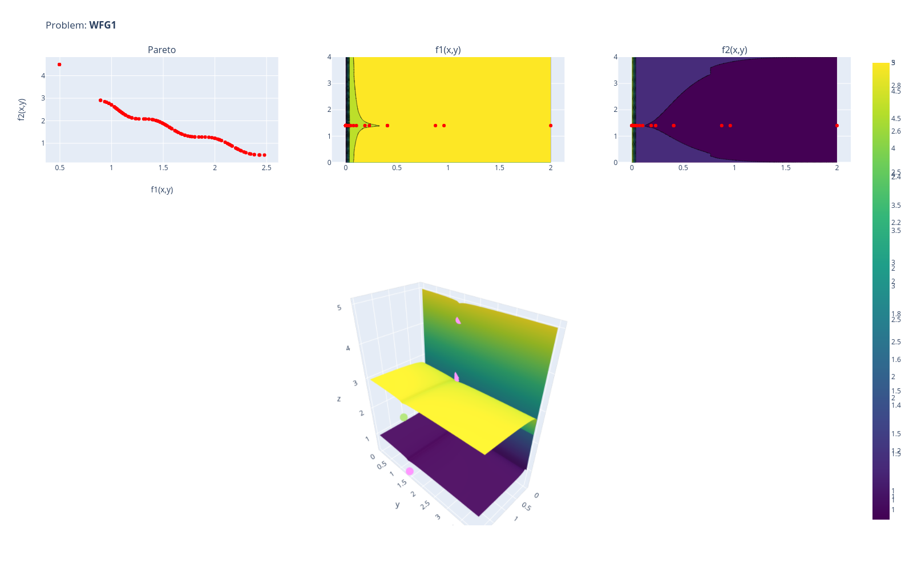

## Benchmark results for WFG1 with TutorM



### Portfolio
```python 
# [1]
gp_mauna = gp.GaussianProcessRegressor(kernel=KERNEL_MAUNA, n_restarts_optimizer=20)

# [2]
grad_uni = ModelsUnion(models=[GradientBoostingRegressor(n_estimators=500)], split_y=True)

# [3]
svr_rbf = SVR(kernel='rbf', C=100, gamma=0.1, epsilon=.1)
svr_uni = ModelsUnion(models=[svr_rbf], split_y=True)

# [4]
mlp_reg = MLPRegressor(hidden_layer_sizes=(20, 60, 20), activation='relu', solver='lbfgs')
mlp_uni = ModelsUnion(models=[mlp_reg], split_y=True)
```

### Configurations
- **Benchmark 1:**

    single best surrogate (ndf-score), 100 initial samples
    ```json
    [{
        'problem_name': ['wfg'],
        'prob_id': [1], 
        'prob_dim': [2],
        'obj': [2],
        'eval_budget': [1000],
        'pred_count': [10],
        'surr_port': [[gp_mauna, grad_uni, svr_uni, mlp_uni]],
        'solver': ['moea_control'],
        'train_test_sp': [0.25],
        'cv_threshold': ['(test_r2 > -1000)'],
        'test_threshold': ['(ndf_surr_score > -1000)'],
        'solution_comb': ['ndf'],
        'start_set_%': [0.1],
        'seed': [SEED]
    }]
    ```

- **Benchmark 2:**

    surrogate stack, 100 initial samples
    ```json
    [{
        'problem_name': ['wfg'],
        'prob_id': [1], 
        'prob_dim': [2],
        'obj': [2],
        'eval_budget': [1000],
        'pred_count': [10],
        'surr_port': [[gp_mauna, grad_uni, svr_uni, mlp_uni]],
        'solver': ['moea_control'],
        'train_test_sp': [0.25],
        'cv_threshold': ['(test_r2 > -1000)'],
        'test_threshold': ['(ndf_surr_score > -1000)'],
        'solution_comb': ['stack'],
        'start_set': [0.1],
        'seed': [SEED]
    }]
    ```

- **Benchmark 3.1:**

    surrogate stack + validation, 100 initial samples
    ```json
    [{
        'problem_name': ['wfg'],
        'prob_id': [1], 
        'prob_dim': [2],
        'obj': [2],
        'eval_budget': [1000],
        'pred_count': [10],
        'surr_port': [[gp_mauna, grad_uni, svr_uni, mlp_uni]],
        'solver': ['moea_control'],
        'train_test_sp': [0.25],
        'cv_threshold': ['(test_r2 > 0.65)'],
        'test_threshold': ['(ndf_surr_score > 0.6)'],
        'solution_comb': ['stack'],`
        'start_set': [0.1],
        'seed': [SEED]
    }]
    ```

- **Benchmark 3.2:** [data](../default_tutor/README.md)

    surrogate stack + validation, 0 initial samples
    ```json
    [{
        'problem_name': ['wfg'],
        'prob_id': [1], 
        'prob_dim': [2],
        'obj': [2],
        'eval_budget': [1000],
        'pred_count': [10],
        'surr_port': [[gp_mauna, grad_uni, svr_uni, mlp_uni]],
        'solver': ['moea_control'],
        'train_test_sp': [0.25],
        'cv_threshold': ['(test_r2 > 0.65)'],
        'test_threshold': ['(ndf_surr_score > 0.6)'],
        'solution_comb': ['stack'],`
        'start_set': [0],
        'seed': [SEED]
    }]
    ```
