---
author-meta:
- Oleksandr Husak
- M.Sc. Dmytro Pukhkaiev
- "Dr.-Ing. Sebastian G\xF6tz"
- Prof. Dr. rer. nat habil. Uwe Assmann
date-meta: '2020-05-29'
header-includes: "<!--\nManubot generated metadata rendered from header-includes-template.html.\nSuggest improvements at https://github.com/manubot/manubot/blob/master/manubot/process/header-includes-template.html\n-->\n<meta name=\"dc.format\" content=\"text/html\" />\n<meta name=\"dc.title\" content=\"Compositional Multi-objective Parameter Tuning\" />\n<meta name=\"citation_title\" content=\"Compositional Multi-objective Parameter Tuning\" />\n<meta property=\"og:title\" content=\"Compositional Multi-objective Parameter Tuning\" />\n<meta property=\"twitter:title\" content=\"Compositional Multi-objective Parameter Tuning\" />\n<meta name=\"dc.date\" content=\"2020-05-29\" />\n<meta name=\"citation_publication_date\" content=\"2020-05-29\" />\n<meta name=\"dc.language\" content=\"en-US\" />\n<meta name=\"citation_language\" content=\"en-US\" />\n<meta name=\"dc.relation.ispartof\" content=\"Manubot\" />\n<meta name=\"dc.publisher\" content=\"Manubot\" />\n<meta name=\"citation_journal_title\" content=\"Manubot\" />\n<meta name=\"citation_technical_report_institution\" content=\"Manubot\" />\n<meta name=\"citation_author\" content=\"Oleksandr Husak\" />\n<meta name=\"citation_author_institution\" content=\"Faculty of Computer Science, TU Dresden\" />\n<meta name=\"citation_author_orcid\" content=\"0000-0002-1676-0042\" />\n<meta name=\"citation_author\" content=\"M.Sc. Dmytro Pukhkaiev\" />\n<meta name=\"citation_author_institution\" content=\"Faculty of Computer Science, TU Dresden\" />\n<meta name=\"citation_author\" content=\"Dr.-Ing. Sebastian G\xF6tz\" />\n<meta name=\"citation_author_institution\" content=\"Faculty of Computer Science, TU Dresden\" />\n<meta name=\"citation_author\" content=\"Prof. Dr. rer. nat habil. Uwe Assmann\" />\n<meta name=\"citation_author_institution\" content=\"Faculty of Computer Science, TU Dresden\" />\n<link rel=\"canonical\" href=\"https://Valavanca.github.io/compositional-system-for-hyperparameter-tuning/\" />\n<meta property=\"og:url\" content=\"https://Valavanca.github.io/compositional-system-for-hyperparameter-tuning/\" />\n<meta property=\"twitter:url\" content=\"https://Valavanca.github.io/compositional-system-for-hyperparameter-tuning/\" />\n<meta name=\"citation_fulltext_html_url\" content=\"https://Valavanca.github.io/compositional-system-for-hyperparameter-tuning/\" />\n<meta name=\"citation_pdf_url\" content=\"https://Valavanca.github.io/compositional-system-for-hyperparameter-tuning/manuscript.pdf\" />\n<link rel=\"alternate\" type=\"application/pdf\" href=\"https://Valavanca.github.io/compositional-system-for-hyperparameter-tuning/manuscript.pdf\" />\n<link rel=\"alternate\" type=\"text/html\" href=\"https://Valavanca.github.io/compositional-system-for-hyperparameter-tuning/v/d10dc7081d7b739c65d803b0a7635461e8b00a04/\" />\n<meta name=\"manubot_html_url_versioned\" content=\"https://Valavanca.github.io/compositional-system-for-hyperparameter-tuning/v/d10dc7081d7b739c65d803b0a7635461e8b00a04/\" />\n<meta name=\"manubot_pdf_url_versioned\" content=\"https://Valavanca.github.io/compositional-system-for-hyperparameter-tuning/v/d10dc7081d7b739c65d803b0a7635461e8b00a04/manuscript.pdf\" />\n<meta property=\"og:type\" content=\"article\" />\n<meta property=\"twitter:card\" content=\"summary_large_image\" />\n<link rel=\"icon\" type=\"image/png\" sizes=\"192x192\" href=\"https://manubot.org/favicon-192x192.png\" />\n<link rel=\"mask-icon\" href=\"https://manubot.org/safari-pinned-tab.svg\" color=\"#ad1457\" />\n<meta name=\"theme-color\" content=\"#ad1457\" />\n<!-- end Manubot generated metadata -->"
keywords:
- multi-objective optimization
- surrogate models
- parameter tuning
- search-based software engineering
lang: en-US
title: Compositional Multi-objective Parameter Tuning
...

Master Thesis 

<small><em>

([permalink](https://Valavanca.github.io/compositional-system-for-hyperparameter-tuning/v/d10dc7081d7b739c65d803b0a7635461e8b00a04/))
</em></small>
 
## Authors

+ **Oleksandr Husak** 
    {.inline_icon}
    [0000-0002-1676-0042](https://orcid.org/0000-0002-1676-0042)
    {.inline_icon}
    [Valavanca](https://github.com/Valavanca)  
  
     Faculty of Computer Science, TU Dresden
  

+ **M.Sc. Dmytro Pukhkaiev** 
    {.inline_icon}
    [website](https://tu-dresden.de/ing/informatik/smt/st/die-professur/mitarbeiter?person=412&embedding_id=1e8badf421c649b89f65fb84a05ecbb0&set_language=en)  
  
     Faculty of Computer Science, TU Dresden
  

+ **Dr.-Ing. Sebastian Götz** 
    {.inline_icon}
    [website](https://tu-dresden.de/ing/informatik/smt/st/die-professur/mitarbeiter?person=143&embedding_id=1e8badf421c649b89f65fb84a05ecbb0)  
  
     Faculty of Computer Science, TU Dresden
  

+ **Prof. Dr. rer. nat habil. Uwe Assmann** 
    {.inline_icon}
    [website](http://www1.inf.tu-dresden.de/~ua1/)  
  
     Faculty of Computer Science, TU Dresden
  

Abstract {#abstract .page_break_before}
========

Multi-objective decision-making is critical for everyday tasks and
engineering problems. Finding the perfect trade-off to maximize all the
solution’s criteria requires a considerable amount of experience or the
availability of a significant number of resources. This makes these
decisions difficult to achieve for expensive problems such as
engineering. Most of the time, to solve such expensive problems, we are
limited by time, resources, and available expertise. Therefore, it is
desirable to simplify or approximate the problem when possible before
solving it. The state-of-the-art approach for simplification is
model-based or surrogate-based optimization. These approaches use
approximation models of the real problem, which are cheaper to evaluate.
These models, in essence, are simplified hypotheses of cause-effect
relationships, and they replace high estimates with cheap
approximations. In this thesis, we investigate surrogate models as
wrappers for the real problem and apply Multi-objective evolutionary algorithm (MOEA) to find Pareto optimal
decisions.

The core idea of surrogate models is the combination and stacking of
several models that each describe an independent objective. When
combined, these independent models describe the multi-objective space
and optimize this space as a single surrogate hypothesis - the surrogate
compositional model. The combination of multiple models gives the
potential to approximate more complicated problems and stacking of valid
surrogate hypotheses speeds-up convergence. Consequently, a better
result is obtained at lower costs. We combine several possible surrogate
variants and use those that pass validation. After recombination of
valid single objective surrogates to a multi-objective surrogate
hypothesis, several instances of MOEAs provide several Pareto front
approximations. The modular structure of implementation allows us to
avoid a static sampling plan and use self-adaptable models in a
customizable portfolio. In numerous case studies, our methodology finds
comparable solutions to standard NSGA2 using considerably fewer
evaluations. We recommend the present approach for parameter tuning of
expensive black-box functions.

Introduction {#sec:intro}
============

Motivation
----------

To find solutions to real-world engineering problems, it is often
necessary to find and apply adequate parameters. The search for these
parameters is a computationally expensive problem and requires
optimization. This search is often achieved with the help of the
parameter tuning or in other words, parameter optimization process.
Traditionally engineers adhere to the manual parameter tuning; they put
the effort in searching the optimal objectives guided by experience and
intuition. Nevertheless, many of these optimization problems have vast
search spaces that could be handled only with automatic tools. These
tools can extrapolate and highlight the most perspective parameters from
infinite space. At the same time, they struggles with multi-criteria
decisions that are critical for engineering problems. For examples:
architecture design, test generation, tuning machine-learning algorithms
could be stated as multi-objective problems. To understand the space of
possible solutions, they are represented on the Pareto front; i.e., the
subset of solutions that could be not improved in some objective without
degrading another. Multi-objective algorithms allow to find out some
Pareto optimal solutions. Still, we require a massive amount of
evaluations to obtain those solutions, and that is inappropriate for
expensive problems. A common approach in the reduction of the final cost
of the optimization algorithm is to replace some expensive estimations
with cheaper ones with the help of surrogate models. The conventional
algorithms to extrapolate available results are Bayesian Regression
model (Kriging), neural networks, Support Vector Regression (SVR) or
Tree regressions (Decision) estimators. However, almost all
optimizations approaches use static models or aggregate several
instances of one model type. These approaches lack variability and
cannot be finely tuned.

Ability to change the surrogate model strongly influences the
optimization result. There is a demand for a strategy that allows us to
combine multiple single-objective surrogate models to extrapolate
multi-dimensional search spaces. This composition would make the
surrogate model more versatile and capable of describing arbitrary
optimization problems. Furthermore, it has been noted that the surrogate
is domain-specific, and the same technique might perform differently on
different problems. That is why extrapolation variability from the range
of models improves final optimization results. However, only few
researchers have addressed the solution of dynamic surrogate model
selection.

Also, it is essential to obtain the necessary and sufficient number of
samples to build an appropriate model. Unfortunately, to choose the
optimum number of samples, it is required to have additional knowledge
about a problem that is usually unknown. Moreover, arbitrary decisions
on the sample size might be a reason that leads to inaccurate models and
further wrong results.

Objectives
----------

For this thesis, we have chosen two broad objectives that we tried to
achieve. The first objective is to develop strategies that can
dynamically compose the surrogate model from several single-objective
models. The second objective is to enhance parameter tuning with the
best practices from multi-objective optimizations techniques. Successful
fulfilment of those objectives means an overall improvement in the area
that concerns with optimization of expensive black-box functions. Also,
success implies the possibility of application of developed tools to the
broader spectre of real-world problems.

Research questions {#rq}
------------------

To achieve our objectives we defined three research questions, which we
answer in this thesis. Those research questions are:

- **RQ1**: Does the dynamic composition of different single-objective
    models improve the extrapolation of multi-objective problems?

- **RQ2**: Does a portfolio of surrogate models enhance optimization
    results?

- **RQ3**: Does a dynamic sampling plan help accelerate obtaining an
    optimal solution?

The purpose of this study is to provide a mechanism of a fined-grained
models composition that allows making a superior multi-objective
decision. Prerequisite for such solution is to reduce the number of
actual evaluations while keeping the optimal quality of a decision.

Results overview
----------------

In this thesis, we introduce a modular structure for multi-objective
parameter tuning that allows us to use various surrogate models and
apply various optimization techniques. The overall results were achieved
in several stages: 1) In response to RQ1, a composite model was
implemented to combine several surrogate models. This solution made it
possible to treat multi-objective extrapolation as a combination of
single-objective models. 2) In response to RQ2 and RQ3, we developed a
surrogate portfolio that enhances our strategy with the possibility to
select surrogate models dynamically. Model selection is based on
surrogate validation, which is also used as a criterion to check the
sampling plan. An approach, combining all the aforementioned key
features that answer the research questions was implemented under the
name TutorM.

The evaluation results from a wide range of problems showed excellent
results and advantage of TutorM strategy over comparable approaches:
NSGA2 and Hypermapper 2.0. TutorM also provides a possibility of
scalable solutions for problems that demand that.

The results can be used to improve the applicability of model-based
optimization to a variety of expensive multi-objective parameter tuning
problems.

Background {.page_break_before #sec:background}
==========

This chapter presents general background information needed to follow
the terms and methods used in this thesis.

Parameter tuning
----------------

We start by introducing a parameter tuning problem. We consider a
objective function as a black-box
$f : \mathbb{S} \rightarrow \mathbb{R}$ with parameter and objective
spaces (Figure {@fig:spaces}). All feasible combinations of parameters
define a parameter space which is intended to be a function input
$\mathbb{S}$, and therefore all possible function outputs are defined as
an objective space or $f(x), x \in \mathbb{S}$. The minimization of the
fitness function could be defined as follows:

$$\label{eq:arg_min}
                    x^* = \underset{x \in \mathbb{S}}{\arg\min} f(x)$$

{#fig:spaces width=100%} 

The mapping of all points from the parameter space to the points in the
objective space is called a fitness landscape. The goal of parameter
tuning is to find optimal points on this surface. Depending on the type
of landscape, the optimization search often yields qualitatively
different behaviour. A single criterion in the parameter tuning process
might not be sufficient to characterize the behaviour of the
configuration space correctly. Therefore, multiple criteria have to be
considered. Typical examples of objectives are to enhance accuracy and
performance or minimize runtime, error rate and energy. The parameter
tuning process should improve the objectives of those in which none of
the objectives can be improved without affecting another objective. By
default, we consider minimization for all objectives. In this thesis, we
are interested in the following properties of parameter tuning:

-   Evaluation is expensive.

-   Black-box function and the number of evaluated results are unknown.

-   Multi-objectivity with global minimization.

Multi-objective optimization
----------------------------

Common parameter tuning problems require the simultaneous optimization
of multiple, usually contradictory, objectives
$f = (f_1(x), \ldots, f_k(x))$. Multi-objective optimization deals with
such conflicts. It provides a mathematical algorithm with which to
obtain an optimal design state that accommodates the various criteria
demanded by the situation. Objectives are being improved simultaneously
and gradually.

The solution to the multi-objective problem is a group of points which
are placed on a Pareto front; i.e. the subset of solutions which are not
worse than any other and better at least one goal [@15iqjq0XF]. A
solution is called a Pareto optimum if no other solution dominates it.
For example (Figure {@fig:dominated}) a solution $A \in \mathbb{S}$ is said to dominate another solution $B \in \mathbb{S}$ , denoted $A \preceq B$ if $f_i(A)<=f_i(B)$ for all $i=1, \ldots ,k$ and $f_i(A)<f_i(B)$ for at least one $i \in \{1, \ldots k\}$. All points on the Pareto frontier are not dominated by any other point in the objective space [@czq5Shcc].

Awareness of the Pareto front allows appropriate decision-making and the
importance of the criteria to be visualized. For the multi-objective
problem, we consider the solution as points from the parameter space
which lead to non-dominated results in the objective space. Improvement
of the solution means finding a set of points that corresponds better
with the real Pareto front.

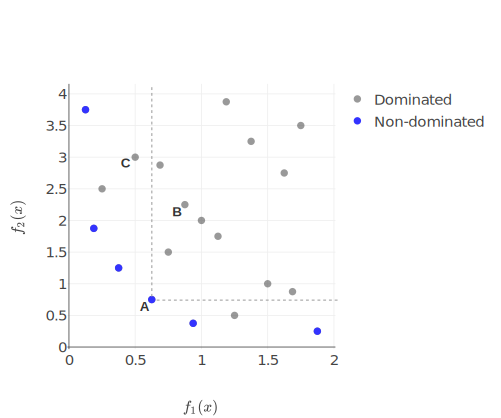{#fig:dominated width=100%}

### Metrics for multi-objective solution

In a single-objective optimization, the quality of a given solution is
trivial to quantify. When we consider a solution of a multi-objective
problem as a Pareto optimal approximation, the comparison of these
solutions is also a multi-objective task. The question of picking
metrics for evaluation is essential for comparison of approximated
solutions and for selection of the next appropriate set of
configurations.

According to [@cgOPGY3M], a Pareto front approximation should satisfy
the following criteria:

-   The distance between the Pareto front and its approximation should
    be minimized.

-   A wide distribution of non-dominated points is desirable.

-   The range of the approximated front should be maximized, i.e., for
    each objective, a wide range of values should be covered by the
    non-dominated points.

The metrics for performance indicators are partitioned into four groups
according to their properties [@vbJ1WiNp]:

-   *Cardinality.* Estimation of the number of non-dominated points.

-   *Convergence.* Estimation of the closeness of a set of non-dominated
    points to the Pareto front in the objective space.

-   *Distribution and spread indicators.* Measurement of the points
    distributed on the Pareto front approximation or of their allotment
    in extreme points of the Pareto front.

-   *Convergence and distribution indicators.* Capture of both the
    properties of convergence and distribution.

According to [@DCdONjBz], the spread metrics try to measure the
areas achieved in a computed Pareto front approximation. This type of
metrics is not very useful for comparison of algorithms or for
evaluation of optimization convergence because spreadness is not related
to improvement the objectives. However, they could be useful for a more
detailed analysis of the optimization process or for composing Pareto
frontier from several solutions.

The goal of the multi-objective optimization is to obtain an
approximated solution set with the reference to the Pareto front,
including the following subgoals:

-   All solution sets are as close as possible to the Pareto front.

-   All solution sets are as diverse as possible in the objective space.

-   The proportion of the solution set to the evaluated set is as large
    as possible.

-   Evaluate as few solutions as feasible.

For multi-objective optimization, an algorithm should produce a set of
solutions which provide the optimal trade-off between the considered
optimization objectives. Therefore, the performance comparison of Multi-objective optimization
algorithms is based on their Pareto sets. In this study, four well-known
metrics are used to quantify the performance of algorithms.

-   **Hypervolume (HV).**[@cgOPGY3M] *Convergence and distribution
    indicator.* This metric represents the volume of the objective space
    which is filled by the individuals points of non-dominated solutions
    which belong to the Pareto front (Figure {@fig:hypervolume} {@fig:hypervolume_impr}). Two
    points delimit the volume: one point represents the reference point
    $r$ ($r \in R^m$) which is defined as the worst solution inside the
    objective spaceand the other one is the point which represents the
    Pareto approximation $S$, for all $z \in S, z \prec r$. The
    hypervolume metric is defined as follows:

    $$HV(S,r) = \lambda_m(\bigcup\limits_{z \in S} [z;r])$$

    where $\lambda_m$ is m-dimensional Lebesgue measure. Calculating the
    hypervolume indicator is a computationally expensive task.
    Furthermore, in the case of a small number of dimensions and a low
    number of points, there are currently no known algorithms which
    might return the results fast enough for use due to the
    computational complexity which is
    $\mathcal{O}(|S|^{\frac{m}{2}}\log{|S|}) $ [@Hp8tHCir].

-   **Non-dominated Ratio (NDR).** *Cardinality.* This metric is the
    ratio between the number of non-dominated points and the total
    number of the evaluated points. Higher values are preferred to lower
    ones.

-   **Spacing [@1AKoZUHA4].** *Distribution and spread.* This
    metric describe the distribution of Pareto points. As a wide range
    of similar metrics which are based on the distance to the nearest
    neighbour, spacing does not cover the holes in Pareto frontier and
    might compute the distribution in solution clusters.

-   **$\Upsilon$-metric (p-distance)**[@kRD0G3XY] *Convergence* The
    average distance of a set of points in relation to the Pareto front.
    $\Upsilon$-metric is defined by

    $$\Upsilon(S) = \frac{1}{|S|}\sum_{z\in S}g(z)-g(x^*)$$ where $g$ is
    a distance function and $x^*$ is the Pareto-optimal decision vector.
    The lower the $\Upsilon (S)$, the closer the solutions of S are to
    the solutions of the Pareto front.

{#fig:hypervolume width=85%}

{#fig:hypervolume_impr width=85%}

### Solving methods

Finding a Pareto optimal set is often impractical and computationally
expensive. Therefore, many stochastic search strategies have been
developed, such as: evolutionary algorithms, tabu search, simulated
annealing and ant colony optimization. These algorithms usually do not
ensure finding ideal trade-offs, but try to gain a satisfactory
approximation. In this thesis, we interpret the Pareto optimum as the
optimal solution to the problem. As mentioned, all points on the Pareto
front are non-dominated, but not all non-dominated points are Pareto
optimal. There are several basic approaches which provide information
about how non-dominated points move toward a Pareto-optimal solution.
Those approaches include: scalarization and Multi-objective evolutionary algorithm (MOEA). We describe them in next
the sections.

#### Scalarization

The Scalarizing approach is a popular technique for creating a
single-objective *parameterized* problem with the composite criteria
from multiple objectives. The main advantage of scalarization is the
possibility to use a broad range of single-objective techniques on this
composite function. After optimization, one Pareto optimal solution is
obtained, which depends on the initial scalarization parameters. The
weighted-sum method is a well-known type of scalarizing technique. This
approach concatenates the objectives into a single criterion by using
weighted sum factors. There are difficulties in selecting proper
weights, especially when there is no correlation in prior knowledge
among objectives [@19PHyqZWt; @CE69KuZH].

Some scalarizing techniques try to improve the exploration of the
parameter space by assigning more “intelligent” aggregation to
objectives. Such solutions can be fragile; they change dramatically with
the modification of algorithm parameters. Moreover, the weighting method
cannot provide a solution among underparts of the Pareto surface due to
the “duality gap” for non-convex cases. This refers to the replacement
of a non-convex original function with convex closure which missed
non-convex parts of the initial landscape. Additionally, some
scalarizing algorithms are very sensitive to the number of objectives.
Analysis of the fitness landscape with different scalarizing techniques
might be helpful in the optimization for solving expensive
[@19PHyqZWt].

#### Multi-Objective Evolutionary Algorithms

Evolutionary algorithms form a class of heuristic search methods which
simulate the process of a natural evolution. The evolutionary algorithm
is determined by the two basic principles: selection and variation
[@ZELkJp0w]. While selection reflects competition for
reproduction and resources among individuals, the other principle,
variation, imitates the natural ability to produce new individuals
through recombination and mutation. Evolutionary algorithms are suitable
for several problems, including multiple conflicting objectives and
large and complicated search spaces [@5fPW8AT3; @10qq3sKmV].
Evolutionary optimizers explore populations of candidate solutions in
each generation. Mutators can make changes to the current population. A
select operator then picks the best mutants, which are then combined in
some way to become a new population in the next iteration. However, Evolutionary algorithm (EA)
still needs many evaluations of the black box system to solve the common
multi-objective problem. This problem is crucial for the reason that
most multi-criteria problems are expensive to estimate. This massive
evaluation budget makes EAs infeasible for costly and multi-objective
problems.

Surrogate optimization
----------------------

Many expensive optimization problems have practical limitation on the
number of possible estimations which standard optimization approaches
spend very quickly. To get around this drawback, approximation models or
surrogate models are often used. This technique is essential to reduce
real evaluations by building a regression function based on already
evaluated design points. The potential of the application of surrogates
is based on the generalization of the entire search space and fast
navigations there. This advantage should overrule the disadvantage in
time required to build this approximation. In classical model-based
optimization, a single surrogate model provides a hypothesis on the
relation between the parameter and objective spaces. The approximation
of the solution becomes faster than the real evaluation, so the whole
optimization process is accelerated. However, some extra time is needed
to build and update the surrogate model during the optimization process.
The surrogate model is used to find probable good candidates or to drop
the low-quality individuals even before they are exactly evaluated,
thereby reducing the number of exact evaluations.

In the literature, the term surrogate or model-based optimization is
used in cases when, during the optimization process, some solutions are
not evaluated with the original function but rather are approximated
using a model of this function. Some of the most commonly used methods
are the Response Surface Method [@WHqOntch], Radial Basis
Function [@1FOgcJYL9], Neural Network [@115GeSP44], Kriging
[@1Y1nHvc2], and Gaussian Process Modeling
[@1FXlw7TX2; @4nfjnHfv]. Surrogates are also used to rank and
filter out the offspring according to Pareto-related indicators like a
hypervolume [@iL724s1s], or a weighted sum of the objectives
[@890MGfiJ]. If the model is a single-criterion, it could be
expanded to a multi-objective surrogate by considering each criterion in
isolation and duplicating the model for each of them
[@13Kf7htnk; @2c1WpqTZ]. The surrogate model is either
selected randomly or due to its popularity in the associated domain area
[@CrJQ8Xau]. Thus, there are still some open challenges related to the
combination of meta-models, such as a definition of a selection
criterion or combination techniques. Besides, there are no guidelines
for using heterogeneous compositional models for different objective
functions [@CrJQ8Xau].

#### Multi-objective parameter tuning

The categorization of parameter tuning approaches based on the workflow
of sequential model-based optimization is presented in Figure
{@fig:mo_param_tuning}. The optimization process begins with an
initial sampling plan. At this stage, it is necessary to collect fitness
results or to evaluate the first parameters which are used to build
surrogate models. For an initial sampling plan, or a Design of Experiments plan, the
techniques of Latin hypercube sampling, Sobol sampling or random sampling can be used.

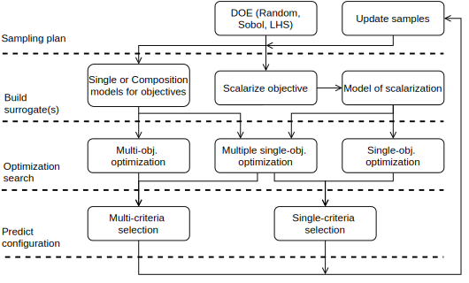{#fig:mo_param_tuning width=100%}

There are two established approaches to extrapolate the samples: 1) to
scalarize objectives and produce a surrogate model of this scalarization
(In this case, the multi-objective problem transforms into a
single-objective one); 2) to keep the original dimensionality of the
problem and apply one or several models to hold and infer on the problem
landscape.

The next step, optimization, is the search for optimal points within the
surrogate model. At this step, the solutions which might be
Pareto-optimal are found. In predict configurations phase, sorting and
selection are carried out. In the case of multi-criteria selection, it
is necessary to select the required number of points which are optimal
for all objectives. Theoretically, all non-dominated points are equal
regardless of the order they are chosen in. The possible prediction of
several parameters instead of a single one is an advantage that improves
the exploration of the parameter space and parallelizing of fitness
evaluation. The required number of points allows the sample set to be
estimated as well as updated. Optimization iterations continue until a
stop condition is satisfied.

Variability and extensibility are essential for configurable parameter
tuning, as in a software product line. To this effect, the optimization
round is consistent and universal. As shown in Figure
{@fig:mo_param_tuning}, the potential to reuse components in a
workflow is enormous. The same single-objective models can be equally
applied to various types of problems in multi-/single-objective
optimization. An optimization algorithm weakly depends on the type of
surrogate model. By dynamic duplication of the surrogate model or even
by the creation of several surrogate hypotheses, we aim to improve the
parameter tuning to multiply criteria on-the-fly.

### Domain-specific problem

Surrogate models are domain-specific in case of intention to find the
best solution with less effort. On the one hand, the surrogate model
could perform well while extrapolation one class of problems and guide
to the optimal solution. On the other hand, this model could be a reason
for a significantly degrading result in another type of problem. That is
why the authors prefer using several surrogate models and don’t select
one for all use cases [@CrJQ8Xau].

It could be an interpreted as a Non-Free-Lunch theorem in model-based optimization. If we
extend this argument, then the same optimization problem in different
parameter tuning iteration could be interpreted as another optimization
problem. In order to reduce an effort and to increase the convergence of
an algorithm, we should change the surrogate model depending on how many
samples we have. This leads us to the usage of a portfolio with
surrogate models. On each optimization iteration, the portfolio tries to
build and select several models with the best performance. As a negative
consequence, building several models introduces an additional overhead
into the optimization time.

### Initial sampling set

Initial samples should provide maximal information to build a useful
surrogate model. Indeed, the overall result of the optimization depends
primarily on how accurate the initial assumption is; an invalid
optimization model makes all further optimization results irrelevant.
The concept of surrogate validity guarantees that the model can
confidently be used to find optimal solutions.

If no valid models are obtained, it is better to use the initial design
than to be guided by an incorrect model. With an increasing sample size,
in case of proper fitting, a better surrogate model is obtained, and the
better results in optimization are reached. Moreover, the initial sample
size might be too big, which is a mere waste of resources.

Discussion
----------

Most methods for parameter tuning optimization are related to
surrogate-based optimization. One of the main advantages of this
approach is the speed of evaluation across the entire search space and
possibilities to apply a broad range of optimization techniques.
However, there are also disadvantages, such as the extra time required
to select and build this surrogate model. It would be desirable to have
a way to combine several surrogate models which are sample- and
domain-dependent.

Related Work {#sec:related}
============

This section overviews other studies in the area of surrogate-based
multi-objective optimization and related approaches of other types of
optimization.

Comparison criteria
-------------------

Many existing approaches can be categorized as multi-objective
optimization approaches. Therefore, the comparison criteria for a clear
and concise definition of the approach are introduced in this thesis:

-   **Sampling plan** specifies the size of a sample set from which to build a surrogate
    model and the sampling strategy that will pick these samples. The
    sampling plan can be static when decisions about samples are made
    ahead of time or it can be dynamic when they depend on optimization
    success.

-   **Surrogate type** is describe extrapolation models and a composition
    strategy to combine these models. In this context, variability
    indicates that the surrogate model is exchangeable and can be
    selected for a specific problem. The extensibility of a surrogate
    refers to the ability to grow and improve general extrapolations for
    a particular problem.

-   **Optimization algorithm** is applied to find the optimal points in the search space. The
    architecture of the optimization algorithm and the surrogate model
    can be tightly coupled (OSI) either when the surrogate model is nested
    in the optimization algorithm, or when they perform flat
    architecture with ASO (Figure {@fig:surr_opt_architecture}).

    ![Example of a possible combination the optimization algorithm with the surrogate model [@nUhAXe3p]](images/utility/architecture_surr_opt.svg){#fig:surr_opt_architecture width=100%}

-   **Scalability** refers to the dimensionality of problems that were applied to
    analyze the performance of the algorithm.

-   **Multi-point proposal** is a property of yielding the required number of multi-objective solutions.

Almost all related works of parameter tuning could be categorized as Sequential model-based optimization (SMBO)
[@1Bbk0txPF]. The general looks as follows (Figure {@fig:sequential_mbo}):

1.  Start with the initial sample plan of evaluation points.

2.  Build a regression model to provide a hypothesis about the relation
    between parameters and objectives.

3.  Use the built surrogate model as a parameter for optimization
    strategy. The solutions from the optimization algorithm are new
    promising points for evaluation.

4.  Evaluate the new predicted points and add them to the existing
    samples.

5.  If the stop criteria are not met, repeat optimization with the
    updated sample set.

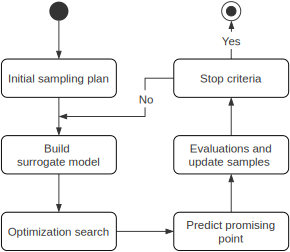{#fig:sequential_mbo width=100%}

We present an overview of previous work on model-based multi-objective
optimization. We begin the project for model-based optimization (mlrMBO)
and continue with related algorithms including various optimization
improvements.

Platforms and frameworks
------------------------

There are many different projects that can perform multi-objective
optimization. Frameworks provide multiple multi-objective algorithms,
performance metrics, built-in test problems and extra tools such as
plotting and benchmarks. Some frameworks focus on efficient calculations
and parallelization [@14vOEgTO2], others on implementation
of modern multi-objective algorithms
[@om6wdVM3; @SrxLVL7k] and on support of plenty of
model-based optimization algorithms [@11i9KPh5u].

#### mlrMBO

[@11i9KPh5u] is a modular framework for model-based optimization of
expensive black-box functions. MlrBO extends the SMBO procedure to a
multi-objective problem with mixed and hierarchical parameter spaces.
Modular structure and integration with *mlr*[^1] library allows all
regression models to be used and compositional techniques such as
bagging and ensembling to be applied. The authors implemented four
different model-based multi-objective algorithms that are categorized in
three classes: 1) Scalarization-based algorithms that optimize a
scalarize version of the black-box functions (). 2) Pareto-based
algorithms that build individual models for each objective and complete
multi-objective optimization (MSPOT [@8Wbkj1xf]). 3) Direct
indicator-based algorithms which also fit individual models, but perform
a single objective optimization on the collection of all models (SMS-EGO
[@gqqWjGkp], $\epsilon$-EGO [@XcwIljhD]). A special feature of the
mlrMBO framework is multi-point proposal prediction on each iteration.
However, it does not provide a combination of different surrogate models
into one model.

#### BRISE 2.0 {#alg:BRISE}

[@OYrq2ZLd] is a software product line for parameter tuning. The core
topics of their approach are extensibility and variability with key
features such as 1) A *repeater* which automatically decides on the
number of repetitions needed to obtain the required accuracy for each
configuration. 2) *Stop condition*, which validates a solution received
from the model and decides whether to stop the experiment. 3)
Association of a sampling plan with model prediction validity which
provides a *flexible sampling plan*. The main advantage of this sampling
plan is that it requires less initial knowledge about the optimization
problem. Extrapolation model for parameter prediction is exchangeable
and it combines surrogate and optimization strategies in each
implementation. Several general models, such as polynomial regression
surrogate with local search and Bayesian optimization with bandit-based
methods strategy(BOHB [@1FBsMpBkY]), are implemented. However, the
models lack variability and should be designed from scratch for new
domain-problem.

#### SMAC

[@e2TT8RyQ; @hC44c3Vm] is a framework for parameter tuning with
Bayesian Optimization in combination with a simple racing mechanism to
decide which of two configurations performs better. SMAC adopted a
random forest model and Expected Improvement (EI) to model conditional
probability. It applies a local search with several starting points to
pick configurations with a maximal value of EI. These points improve the
exploration possibilities of SMAC in the search space with higher
uncertainty and an optimal value of the objective mean. An interesting
feature of SMAC is its support of the termination of unfavourable
evaluations that are slowing down the optimization process. However,
SMAC is limited to single-criteria optimization and uses a predefined
sampling plan.

#### Hypermapper 2.0

Luigi Nardi et al. [@2c1WpqTZ] presented a multi-objective
black-box optimization framework that solves complex parameter tuning
problems with the combination of search space, expensive evaluation, and
feasibility constraints. The proposed approach can be classified as a
direct indicator-based algorithm with constraint validation. During this
type of optimization, several identical individual models for each
objective are built, then a single-objective optimization is performed
on the aggregation from all these models. The authors further extended
this idea to predict no feasible configurations with an extra surrogate
model.

The Hypermapper 2.0 is based on a surrogate of a random forest. The
random forest combines several weak regressors on a subset of samples to
yield accurate regression and effective classification models. After
scalarizing values from models, framework applies an Bayesian
optimization (BO) method to find an optimal value. Since using a single
weight vector would only find one point on the Pareto optimal front, a
weight vector is chosen randomly for each iteration, ensuring that
multiple points on the Pareto optimal front are found. The key features
of this approach are the possibility to use prior knowledge, support
real variables, predict feasibility, and excellent final adaptation of
the implementation to embedded devices. The authors reported that
Hypermapper 2.0 provides better Pareto fronts compared to
state-of-the-art baseline, i.e. better competitive quality and saving
evaluation budget.

Model-based multi-objective algorithms
--------------------------------------

Fixed optimization components can make general optimization ineffective
in the face of different problems. The flexibility achieved by the
surrogate construction methodology and multi-objective (MO) algorithms
can help to achieve solutions closest to the real Pareto optimal front.

#### ParEGO {#alg:ParEGO}

is a scalarization-based multi-objective algorithm [@13Kf7htnk]. It was
developed as extension, which can encompass multi-point proposal, of a
classic single-objective algorithm EGO[@1Bbk0txPF] of Jones et al. In its
core lays repetition of an algorithm execution with randomly changed
scalarization weights for each iteration. This algorithm is based on the
Kriging (Gaussian process regression) model and multiple
single-objective optimization processes on scalarized objectives.
Several runs with random weights guarantee that multiple points on the
Pareto optimal front are predicted. This algorithm and its modification
are implemented in mlrMBO[@11i9KPh5u].

#### An Evolutionary Algorithm(EA) with Spatially Distributed Surrogates

Amitay et al.,[@HSZsAP2u] presented an EA with spatially distributed
surrogates (EASDS). Surrogate models use Radial Basis Function Networks,
periodically validating and updating each subset of samplings points.
This generates a complex ensemble surrogate with approximations in local
areas of the search space. Spatially Distributed Surrogate models are
created for all objectives and then evaluated by NSGA-2 [@HSZsAP2u].
The authors report that their approach achieves better results than
single global surrogate models, multiple surrogates. Of note, the
authors evaluated their algorithm only on bi-objective problems.

#### A hybrid surrogate-based approach for evolutionary multi-objective optimization

Rosales-Pérez et al.,[@n6umRRsz] proposed an approach based on an
ensemble of Support Vector Machines (SVM). The authors describe a model
selection process or hyperparameters selection of SVM based on a
validation technique and a further injection into the surrogate
ensemble. Incremental development of the ensemble includes new
information obtained during the optimization and old evidence stored in
previous models. The training of a new model represents search on the
SVM grid in order to find a kernel with the lowest expected
generalization error. This paper presents a model selection process for
determining the hyperparameters for each SVM in the ensemble.

#### Evolutionary optimization with hierarchical surrogates

Xiaofen Lu et al. [@1a94fr8U] apply different surrogate modelling
techniques based on the motivation to optimize expensive black-box
functions without any prior knowledge of the problem. They used a
pre-specified set of models to construct hierarchical surrogates during
optimization. Also, to verify the surrogates, the general accuracy of
the high-level model was used. The process of the proposed method
involves splitting the accumulated training samples and model-based
optimization, which means that the sample plan is static and requires
prior information about the problem.

The authors show that the hierarchical surrogate structure can be
beneficial when the accuracy of the high-level model is greater than
0.5. They also noticed that a single modelling technique might perform
differently on different problem landscapes. This motivates us to use a
pre-specified set of modelling techniques (portfolio with surrogates).

#### Population-based Parallel Surrogate Search

Akhtar et al.,[@b95kEJCL] introduce a multi-objective
optimization algorithm for expensive functions that connects several
iteratively updated surrogates of the objective functions. The key
feature of this algorithm is high optimization for parallel computation
and stacking predictions from the set of Radial Basis Function (RBF)
models. The algorithm combines RBF composition surrogate, Tabu, and
local search around multiple points.

#### GALE: Geometric Active Learning for Search-Based Software Engineering

Krall et al.,[@15iqjq0XF] developed an algorithm that uses principal
components analysis (PCA) and active learning techniques to perform
step-by-step approximation and evaluation of the most informative
solutions. The authors notice that MOEAs are not suitable for expensive
multi-objective problems because they push a set of solutions towards an
outer surface of better candidates, costing many function evaluations.
The fundamental idea of the proposed approach is to choose the most
informative solutions from a large set of options. This is accomplished
by dividing the functional landscape into smaller regions and evaluating
only the most informative samples from the regions. As a result of the
division of the functional landscape, function evaluations are spared
since only a few of the most informative points from the region are
evaluated. A drawback of this approach lays in static implementation
with MOEA/D.

| **Approach**                      	| **Multi-objective** 	| **Sampling plan** 	| **Extrapolation models** 	| **Composition strategy** 	| **Optimization** 	| **Mixed search space** 	| **Multi-point proposal** 	| **Scalability** 	|
|-------------------------------	|:---------------:	|:-------------:	|:--------------------:	|:--------------------:	|:------------:	|:------------------:	|:--------------------:	|:-----------:	|
| mlrMBO [@11i9KPh5u]                             | ✓               	| static        	| E                    	| V                    	| V            	| ✓                  	| ✓                    	| ✓           	|
| BRISE 2.0 [@OYrq2ZLd]                           | ✗               	| flexible      	| V                    	| V                    	| V            	| ✓                  	| ✓                    	| ✓           	|
| SMAC [@e2TT8RyQ; @hC44c3Vm]                 | ✗               	| static        	| S                    	| S                    	| S            	| ✓                  	| ✗                    	| ✓           	|
| Hypermapper 2.0 [@2c1WpqTZ]              | ✓               	| static        	| S                    	| S                    	| S            	| ✓                  	| ✗                    	| ✓           	|
| ParEGO [@13Kf7htnk]                                | ✓               	| static        	| S                    	| S                    	| S            	| ✗                  	| ✗                    	| ✓           	|
| Distributed Surrogates, EASDS [@HSZsAP2u]         | ✓               	| static        	| S                    	| E                    	| S            	| ✗                  	| possible             	| ✗           	|
| Hybrid surrogate [@n6umRRsz]                  | ✓               	| static        	| S                    	| E+D                  	| V            	| ✗                  	| possible             	| ✓           	|
| Hierarchical surrogates [@1a94fr8U]                  | ✗               	| static        	| E                    	| V                    	| V            	| ✗                  	| possible             	| ✗           	|
| Parallel surrogates, MOPLS [@b95kEJCL]  | ✓               	| static        	| S                    	| E                    	| S            	| ✗                  	| ✓                    	| ✗           	|
| GALE [@15iqjq0XF]                                  | ✓               	| static        	| S                    	| E                    	| S            	| ✓                  	| possible             	| ✓           	|

Table: The comparison of related approaches. The component behaviour: S - static, V - variability, E-extensibility, D - dynamic.
{#tbl:related}

Scope of work
-------------

As shown in Table {@tbl:related}, surrogate or model-based optimization suit expensive
black-box problems. A summary of the related works that we have
discussed is shown in the table above. Nevertheless, model-based
approach still has limitations:

-   Multi-objective hypothesis. A *limited number* of surrogate models
    can handle with several parameter and objectives, but they struggle
    when these parameters and objectives become larger.

-   *Surrogate is domain-specific.* Currently, to improve and reach the
    best prediction, we need to know the objective surface in order to
    apply a specific surrogate. Universal surrogates might gain optimal
    results but may not be the most reliable [@BvoEknRH; @1a94fr8U].

-   The quality of predictions depends on *the number of samples* we use
    for a specific type of surrogate. There is a trade-off between the
    reduction of sample size and maximization of prediction quality.
    Overfitting, as well as underfitting, can guide optimization in a
    wrong direction.

-   Often, optimization algorithms and surrogate models are *coupled*
    extremely tightly. This interdependence makes the general approach
    biased against specific problems. Reimplementation of these
    algorithms for each usage scenario becomes time-consuming and
    error-prone.

After surveying the aforementioned literature, we derive the following
research gaps and questions.

- **Surogate combination**

    Previous research has shown that surrogate model selection can
    profoundly impact the quality of the optimization solution
    [@n6umRRsz]. Furthermore, it has been noted that the surrogate
    is domain-specific, and the same technique might perform differently
    on different problems [@1a94fr8U]. The overall research gaps of the
    surrogate model’s flexibility can be divided into the following
    subproblems:

    1.  The dynamic combination of different single-criterion models is
        crucial to solve the multi-criteria problems. It must be
        feasible to substitute the type of nested surrogate model for an
        arbitrary criterion component. This would make the surrogate
        model more versatile and capable of describing arbitrary
        optimization problems. Therefore, technology that would allow
        the creation of surrogate compositional models is necessary.
        Hence we can identify the first research question **\[RQ1\]**:
        Does the dynamic composition of different single-objective
        models improve the extrapolation of multi-objective problems?

    2.  After scrupulous investigation of presented works we conclude
        that access to the range of models improves final results.
        Unfortunately, most authors used only one type of model with
        various hyperparameters. Therefore, the next research question
        **\[RQ2**\]: Does a portfolio of surrogate models enhance
        optimization results?

- **Sampling plan**

    A static plan requires additional knowledge of the surface of the
    problem, which is usually not possible to obtain. Moreover,
    arbitrary decisions of the sample size might be a reason that leads
    to inaccurate models and further wrong results. These problems may
    occur because the surrogate model is overfitted or underfitted, and
    the result is a waste of samples and resources. Consequently, the
    last research question **\[RQ3\]**: Does a dynamic sampling plan
    help accelerate obtaining an optimal solution?

To our knowledge, there have not been studies of the comprehensive
surrogate combinations and the dynamic sampling strategy. Therefore, we
focus on the improvement of compositional surrogate models for
multi-objective problems. We aim to apply surrogate models to problems
that are expensive, multi-objective, and derivative-free/black-box
systems without constraints.

#### The following goals must be achieved:

1.  Find diverse multi-objective solutions with minimal distance to real
    the Pareto front.

2.  Develop modular and extensible architecture.

3.  Improve the backward computationally with single-objective parameter
    tuning.

4.  Reduce the evaluation budget.

[^1]: [mlr]{}: Machine Learning in R. https://mlr.mlr-org.com/

Compositional Surrogate {#sec:concept}
=======================

This chapter introduces a general idea which overcomes the limitations
of model-based optimization discussed.

As mentioned previously in section @{sec:background}, fixed components
can make the optimization process ineffective. That is why flexibility
and variability must be introduced for each optimization step. Our
concept focuses on the combination of surrogate models to effectively
extrapolation required problems.

Combinations of surrogate models
--------------------------------

Let us address the main issue we have observed in multi-objective
optimization. The issue is that the solution techniques and parametric
selections are usually problem-specific. In addition to that, most
surrogate model implementations are static which imposes limitations on
existing solutions. We tackle this challenge by improving model
variability *in* a surrogate model (compositional surrogate) and model
extensibility *with* surrogate hypotheses (surrogate portfolio). Also,
we should address an additional question of solution scalability, which
is related to the compositional surrogate model. There are some tasks
that could require new algorithmic approaches when we add more
parameters to them. Therefore, there exists a demand for scalable
solutions. We discuss our approach to problems described i+n the next
sections.

### Compositional Surrogate Model \[RQ1\]

The concept of the compositional surrogate is the combination of
multiple simple models to approximate several independent objectives at
the same time. In this model, composite and conventional surrogates have
a unified interface that permits us to implement a *composite design
pattern*[@LiF8v83X]. This design pattern then allows us to operate
uniformly with the individual and multi-objective surrogates.

Additionally, a significant advantage of compositional surrogates is a
possibility to extend single-objective parameter tuning to
multi-objective optimization. This possibility provides the opportunity
to reuse single-criterion models for multi-criteria optimization and
dynamically reconstruct problem representation from mixed parts. We
define *compositional models* as models that combine *various* sub
surrogate models for each optimization objective. The *surrogate
hypothesis* refinement is also used to emphasize that the surrogate
model can completely describe all criteria from the objective space.

The compositional surrogate has multiple opportunities for variability
that outperform static models in the face of real black-box problems.
For example, choosing a specific set of models is a representation of
knowledge about the subject area. If expectations during optimization
are not met, the compositional model can be partially updated, which
saves time. In contrast, a static model would need to be completely
replaced. Such changes might be demanded by newly obtained results or
the increased dimensionality of optimization space.

#### Scalability

The ability to scale the optimization solution can be considered an
adaptation to an unknown problem. Solution scalability is the ability to
solve problems with a high number of dimensions in parameters and
objectives spaces.

Multiple works[@15iqjq0XF; @5eR7xJoM] have practically
demonstrated that scalability is a problem for surrogate models and
optimization algorithms. As an illustration, popular surrogate models
such as Gaussian process regression (Kriging) [@1Bbk0txPF] struggle with
high dimensional samples but provide excellent results in smaller
dimensions. Therefore, another advantage of the composite surrogate
model is evident; it provides variability for the extrapolation of
scalable search space.

### Surrogate model portfolio \[RQ2\]

In addition to the dynamic variability in the compositional surrogate,
we combine several surrogate hypotheses in a surrogate portfolio to
dynamically choose one that is best suited to the specific problem. The
unified interface and the ability to integrate models into a composite
architecture make it possible to uniquely select and combine composite
models side by side with static multi-objective models.

Without information about a given problem, it is difficult to say which
surrogate hypothesis would be better. Therefore, the model should be
selected during optimization based on its usefulness (validity). The
validation process involves checking how well the model extrapolates
unknown data. For such validation evidence, a small portion of samples
should be sacrificed. This process of data sacrifice give us two
separate data sets: one for model building and another for its testing.
The test score obtained from the test set is used to evaluate the
model’s accuracy and, accordingly, the quality of the possible
corresponding solutions. The validation process allows us to evaluate
surrogate models based on how they summarize an unknown problem.

For an optimization algorithm, a portfolio can be considered either as a
single model or as a collection of models. This property allows us to
determine which optimization algorithms are applied to which surrogate
models and how to combine such solutions. Such dynamic variability makes
the multi-criteria optimization process also scalable and flexible.

Besides, the surrogate portfolio does not limit to use the latest
state-of-the-art optimization algorithms and surrogate models together.

Sampling plan \[RQ3\]
---------------------

After surveying the aforementioned related works, we learned that only
BRISE use dynamic sampling plan while other approaches use a static
sampling plan that determines an optimal number of initial samples using
an outside oracle. On the contrary, BRISE is applied dynamic but still
domain-dependant sampling plan. Although in most cases, we cannot
receive any guidance on an unknown problem. Thus, we need a dynamic
sampling plan which adapts to a specific use-case.

To obtain the adaptive sampling size we need to bind the sampling design
to a validation process for the surrogate model. An optimization process
is guided by sampling design when none of the surrogate models are valid
(Figure {@fig:concept_sampling}). Validity means that the surrogate
approximation can be useful for efficient global optimization.

{#fig:concept_sampling width=100%}

### Surrogate Validation

In the context of sequential model-based optimization, a common mistake
is studying the accuracy of the evaluation of the global search space
instead of the search space region of interest. That is why basing the
evaluation of surrogate validity only on the coefficient of
determination(R2) is incorrect [@2c1WpqTZ]. The global
accuracy metric can be used as a threshold value above which the model
becomes invalid even with additional estimations.

It is necessary to sacrifice a small portion of samples to check the
surrogate model’s quality. Based on validation results, we can discard
inadequate models and consider the solutions from valid models only. If
none of the models are valid, the best decision is to now make a
prediction from the sampling plan. This decision is repeated until a
valid surrogate model is obtained.

Validation should show how well the model extrapolates the available
experiments (variance) and how well it can evaluate the data that is not
seen (bias). The central concept in surrogate validation lies in the
adaptation of the best machine-learning approaches for the evaluation of
a model’s performance.

We select surrogate models based on accuracy in the test set, but the
selection may not be correct if only one test set is taken into account.
Increasing surrogate complexity can lead to obtaining wrong conclusions
in a later stage of optimization (Figure {@fig:cv_overfitting}). This
property cannot be neglected in evaluating a surrogate’s validity.

![With rising model complexity overfitting on the training set becomes more likely [@oZVt7BwU; @hXsWZiMi]](images/utility/cv_2x_test.svg){#fig:cv_overfitting width=100mm}

It is necessary to perform the validation in a few phases with separate
test sets. The validation process requires two separate test sets: the
first one to select surrogate models and the second one to test those
selected models. In addition to those two test sets there is a third set
for building surrogate models. We obtain those sets by dividing all
available samples.

Partitioning the available samples into three sets drastically reduces
the number of points that can be used for building the model. A small
number of build samples could lead to inadequacy of the model.
Also, results can depend on the selective random decision for sample
splitting.

However, partitioning the available samples into three sets, are
drastically reduce the number of points which can be used for learning
the model. Moreover, results can depend on a selective random decision
for the samples splitting. The solution is might be cross-validation(CV,
Figure {@fig:cv}). This is a procedure that avoids a separate
validation set and divides test samples to *k* equal folds. Set of folds
are used to train model and in *k* rounds, a new fold selected as a test
set. The performance measured by cross-validation is the averaged over
the values computed in the loop. This approach can be computationally
expensive but requires fewer samples.

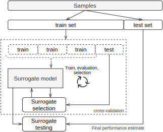{#fig:cv width=100%}

To summarize, the model validation is performed in two stages:

1.  **Cross-validation.** We check overall accuracy of the surrogate
    model extrapolation. Also, we discard models that do not achieve the
    necessary threshold.

2.  **Surrogate testing.** We demonstrate the accuracy of the selected
    models and the corresponding assessment of possible solutions.

We decide which surrogate models to choose based on the information from
all stages. If the model does not achieve a sufficient threshold, it is
rejected as not valid. If there is no valid model, the assumption about
the next configuration is accepted from the sampling plan (Figure
{@fig:concept_sampling}).

Discussion
----------

Toward answering our research questions, we propose the dynamic
combination of surrogate models and a dynamic sampling plan based on
surrogate validation.

-   **RQ1:** For the dynamic combination of several surrogate models, it
    is necessary to implement a surrogate compositional model. This
    design allows uniform handling of individual and compositional
    surrogate models.

-   **RQ2:** The combination of surrogate models in the portfolio is
    realized through the compositional model and stepwise validation.

-   **RQ3:** The sampling plan is chosen to explore new random points
    when there is no valid model. This relation means that the sampling
    plan directly depends on whether we have a surrogate model that is
    capable of describing the optimization problem.

As a result, we extend the idea of classic SMBO using dynamic model selection
and stepwise validation to obtain a multi-objective solution on various
problem landscapes.

Implementation
==============

In this chapter, we present the implementation details of our proposed
decisions.

In order to achieve goals from previous sections, it is necessary
to formulate technical requirements for implementation. After a thorough
study of the literature [@2iBa9w3z], we put forward the following
requirements:

-   **Components.** To meet the needs of flexible architecture, we need
    to divide the optimization workflow into logical steps and abstract
    them. These abstractions are interpreted as easily replaceable
    components. Only in the case of homogeneity of optimization
    processes with the standard interfaces, it is possible to scale the
    optimization approach to multi-objective tasks.

-   **Separation of concerns.** In order to ensure more considerable
    optimization variability, it is necessary to evaluate the
    optimization steps independently.

-   **Non-proliferation of classes.** To improve the compatibility of
    our solution with other frameworks, we need to use a simple
    structure to share information.

The following frameworks were used to fulfill the criteria.

**Scikit-learn** [@5HeKgs4K] is one of the most popular machine
learning framework that accomplishes with a variety of learning tasks.
The crucial features are excellent documentation and reusable components
in various contexts. Extensibility and consistent interfaces resulted in
large and active community of library. Scikit-learn integrates well with
many other Python libraries.

**pygmo2** [@14vOEgTO2] is scientific library with an
effective parallelization for local and global optimization. Key
features of this project are efficient implementations of bio-inspired
and evolutionary algorithms and unified interface to optimization
algorithms and problem definitions.

Next, specific optimization steps will be discussed.

Compositional surrogate
-----------------------

The Composite Surrogate provides the ability to aggregate several simple
models to promote multi-objective extrapolation.

To achieve this goal, the Model-union class (Figure {@fig:munion})
class was implemented. It is implement *a compositional design pattern*
[@LiF8v83X] where several heterogeneous models could be combined. This
class is as meta-model that wraps and aggregate surrogates and could be
combined in a tree structure. Such an architectural solution is needed
to improve the scalability of surrogates as components

A parent class that combines multiple models can combine their
approximations in several ways:

-   **Stacking.** It is an ensemble approximation technique which
    average obtain results from each child model. The child regression
    models are trained based on the whole training samples.

-   **Split y.** A straightforward technique to combine several
    regression models in multi-label prediction case. Each child
    surrogate is trained on the entire dataset, including only one
    objective of interest. This functionality allows as to produce
    multi-objective compositional surrogate from combinations of
    single-objective models.

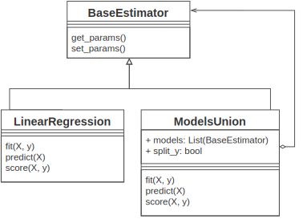{#fig:munion width=100%}

So, Model-union class puts the compositional model on one line with
other surrogate models. It allows us to independently validate many
surrogate models and combine them in a surrogate portfolio.

Optimization orchestrator
-------------------------

The *TutorModel* (TutotM) Class is the orchestrator of all optimization
steps. TutorM is responsible for parallel surrogate build, their
validation and combination. Also, TutorM provides surrogate models to
the optimization algorithm. Due to the principle of separation of
concerns, the surrogate model does no depend on the optimization
technique. As a result, this extensive combination can provide
additional flexibility and the ability to adapt to specific problems. An
example of the workflow of TutorModel is presented in the Figure
{@fig:tutor_activity}, As can we note, there are three surrogate
models in the portfolio, from which pass validation only two.

Validation is the primary source of information for deciding on a
surrogate model.

{#fig:tutor_activity width=100%}

#### Surrogates validation

To select a surrogate model, we need to check the accuracy of the
assumption from unknown experiments(test set). As mentioned in previous
Chapter, validation should be done in several stages to
avoid overfitting (Figure {@fig:simsim_activity_validation}). The
validation steps are as follows: At the first stage, models are selected
based on *cross validation* technique. In this stage define lower bound
for overall accuracy. We notice that pass this threshold does not
guarantee that surrogate is useful. 2) On the last stage, valid models
from the previous stage are evaluated and selected for optimization.

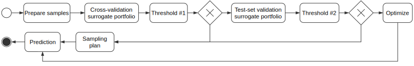{#fig:simsim_activity_validation width=100%}

#### Optimization algorithm

The role of the optimization algorithm is to find a near-optimal
solution based on surrogate approximation. While other methods also
exist, we select as the main solver because it can be applied to a wide
range of problems.

Optimization framework requires the definition of custom problems. The
optimization problem is not built on top of surrogate models, but are
used with the help of surrogate models. In the case of the genetic
algorithm, it produces the population of parameters, that could be
treated as a Pareto front approximation. If several surrogates are valid
than several Pareto front approximations obtain. There are two
approaches to select the most informative solutions: 1) pick Pareto
approximation from surrogate with the highest accuracy in non-dominated
points. 2) Assume that all approximations are valid and all points could
be selected. In this case, intersection predictions from samples have a
higher probability of being selected.

#### Surrogate portfolio

Since the surrogate model can produce different results on a different
problem, it is necessary to choose a model from the portfolio.

Surrogate models can be divided into two groups: a multi-output model
for all objectives and compositional model with single-output models.
All models pass validation equally, but after cross-validation
single-objective models should combine with another one to provide
multi-objective surrogate hypothesis. During this process, all
objectives should be restored from valid surrogates.

Conclusion
----------

We implemented a base class that can deal with a composite surrogate
model and can combine arbitrary model to apply for a multi-criteria
problem. The TutorM class is required to bring together implemented
features such as surrogate portfolio, validation strategy and dynamic
compositional model. Also, the requirements for the implementation of
the proposed strategy have been identified. Mentioned requirements are
intended to improve the further support and benefits of the developed
method.

Evaluation
==========

In this chapter, we present the results obtained from our approach.
Additionally, we compare the developed approach with state-of-the-art
strategies: evolutionary algorithms and static compound model-based
optimization.

Experimental setup
------------------

We will begin by introducing a description of the selected optimization
problems and applicable approaches for their analysis. Those problems
include ZDT, DTLZ and WFG problems suits.

### Optimization problems

Different optimization approaches need to applied to the numerous types
of optimization problems to reduce the comparison bias in the obtained
results (direct consequence of the No-free-Lunch theorem). To that mean, we select several
comprehensive synthetic benchmark suites for comparison. They are all
scalable in the parameter space and some are scalable in the objective
space. The problems are designed so that a meaningful comparison can be
obtained for optimization techniques. All cases are minimization
problems.

According to [@1HFetF7vb], the following properties characterize the
optimization problems:

-   *Modality* is a property of the objective surface. Test problems are
    either unimodal, with one global optimum, or multimodal, with
    several local optima. Multimodal problems are more complicated than
    unimodal ones and bear more resemblance with real-world scenarios
    (Figure {@fig:intro_mult_bias}). Deceptive objective functions
    have a special kind of multimodality that has at least two optima —
    a true optimum and a deceptive optimum — but the majority of the
    search space favors the deceptive optimum [@QVZZuqyA].

-   A *geometry* of the Pareto optimal front can be convex, linear,
    concave, mixed, degenerate, disconnected, or some combination of the
    former. It directly influences the algorithm’s performance.

-   A *bias* in landscape transformations impacts the search process by
    biasing the fitness landscape. Bias means that uniformly distributed
    parameters mapped onto a bias area in objective space. This type of
    problem can cause challenges if the bias region is far from the
    Pareto optimal front (Figure {@fig:intro_mult_bias}).

-   *Many-to-one* fitness mapping means that different parameter vectors
    can produce the same objective vector. This property makes the
    search more difficult to optimize because it leads to situation when
    most solutions produce the same result.

-   *Not separability* of the problem means that it can not be solved if
    consider it as a separate optimization problems for each objective.

{#fig:intro_mult_bias width=100%}

#### ZDT

[@cgOPGY3M] is a test suite that consists of a set of two-objective
problems and takes its name from its authors Zitzler, Deb and Thiele. In
their paper the authors propose a set of 6 different scalable problems
all originating from a well thought combination of functions allowing,
by construction, to measure the distance of any point to the Pareto
front. Each test function involves a particular feature that is known to
cause difficulties in the evolutionary optimization process, mainly in
converging to the Pareto-optimal front. For the evaluation of our
combinational surrogate model we selected the following problems:

-   **ZDT1** has a convex Pareto optimal front.

-   **ZDT2** has a non-convex Pareto optimal front.

-   **ZDT3** adds a discreteness feature to the front. Its Pareto optimal
    front consists of several noncontiguous convex parts. The
    introduction of a sine function in this objective function causes
    discontinuities in the Pareto optimal front, but not in the
    parameter space.

-   **ZDT4** has 21 local Pareto-optimal fronts and therefore is highly
    multimodal. It is also called a *multifrontal* problem.

-   **ZDT6** has a non-uniform search space: the Pareto optimal solutions
    are non-uniformly distributed along the global Pareto front and the
    density of solutions is the lowest near the Pareto optimal front and
    highest away from the front.

#### DTLZ

[@yHWkop2U] is an extensive test suite that takes its name from its
authors Deb, Thiele, Laumanns, and Zitzler. It was conceived for
multi-objective problems with scalable fitness and objective dimensions.
All problems in this test suite are box-constrained, continuous,
n-dimensional, multi-objective problems.

-   **DTLZ1** is one of the most difficult test problems in this test set.
    DTLZ1 has a flat landscape and the optimal Pareto front lies on a
    linear hyperplane.

-   **DTLZ2** is an unimodal problem with a concave Pareto front.

-   **DTLZ3** is a multimodal problem with a concave Pareto front. DTLZ3 is
    intended to make convergence on the optimal Pareto front more
    difficult than for DTLZ2.

-   **DTLZ4** is an unimodal problem with a bias toward a dense region of
    solutions.

-   **DTLZ5** has a bias for solutions close to a Pareto optimal curve. This
    problem may be easy for an algorithm to solve. Because of its
    simplicity, it is recommended to use it with a higher number of
    objectives.

-   **DTLZ6** is a more challenging version of the DTLZ5 problem. It has a
    non-linear distance function $g()$, which makes it more difficult to
    find the Pareto optimal front.

-   **DTLZ7** is an unimodal problem for its first objective and multimodal
    for the rest of its objectives. This problem has a disconnected
    Pareto optimal front, which decreases the likelihood that an Evolutionary algorithm(EA) finds
    all optimal regions.

#### WFG

[@1HFetF7vb] is a test suite designed to outperform the previously
implemented test suites. Essential improvements have been achieved in a
many problems. Also, non-separable, deceptive, and mixed-shape Pareto
front problem are included. The WFG test suite was introduced by Simon
Huband, Luigi Barone, Lyndon While, and Phil Hingston. WFG includes the
following problems:

-   **WFG1** is an unimodal problem with a convex and mixed Pareto front
    geometry.

-   **WFG2** is a non-separable and unimodal problem with a convex and
    disconnected Pareto front geometry.

-   **WFG3** is a non-separable, unimodal problem for all but its last
    objective. The last objective is multimodal.

-   **WFG4** is a multimodal problem with a concave Pareto front geometry.
    The multimodality of this problem has a landscape with large hills
    that makes optimization more complicated.

-   **WFG5** is a separable problem with a deceptive landscape and a concave
    Pareto front geometry.

-   **WFG6** is a non-separable and unimodal problem. Its Pareto front
    geometry is concave.

-   **WFG7** is a separable, unimodal problem with a concave Pareto front
    geometry. WFG7 and WFG1 are the only problems that are both
    separable and unimodal.

-   **WFG8** is a non-separable, unimodal problem with a concave Pareto
    front geometry.

-   **WFG9** is a multimodal, deceptive, and non-separable problem with a
    concave Pareto optimal geometry. Similar to WFG6, the
    non-separability of this problem makes it more complicated than WFG2
    and WFG3.

Base on the properties, we decide that ZDT4, ZDT6, DTLZ4, WFG1, and WFG4
can represent a broader spectre of possible problems (Table {@tbl:selected}). Also, solutions to
these problems provide meaningful insight into how our optimization
strategy performs. Therefore, for brevity and more comprehensible
discussion, we present full evaluation only of these problems. However,
we have condensed results for all mentioned problems in appendix.

| **Problem** 	|    **Objective**    	|       **Modality**       	|    **Geometry**   	|       **Bias**       	| **Many-to-one  mappings** 	|
|---------	|:---------------:	|:--------------------:	|:-------------:	|:----------------:	|:------------------------:	|
| **ZDT4**    	|   bi-objective  	| unimodal, multimodal 	|     convex    	|         -        	|             -            	|
| **ZDT6**    	|   bi-objective  	|      multimodal      	|    concave    	|         +        	|             +            	|
| **DTLZ4**   	| multi-objective 	|       unimodal       	|    concave    	|         +        	|             +            	|
| **WFG1**    	| multi-objective 	|       unimodal       	| convex, mixed 	| polynomial, flat 	|             +            	|
| **WFG4**    	| multi-objective 	|      multimodal      	|    concave    	|         -        	|             +            	|

Table: Selected multi-objective test problems.
{#tbl:selected}

### Optimization search

In this thesis, we do not perform explicit parameter tuning for
optimization algorithms. While various optimization algorithms could
have been used, we selected MOEAs as default optimization techniques for
surrogate models. The advantage of EAs are that they can be easily
modified and can operate on a set of solutions candidates that are
well-fitted to approximate the Pareto front. Also, EAs can estimate highly
complex problems in various use-cases. In this thesis, we used two types
of EA:

1.  The popular evolutionary multi-objective algorithm *NSGA2*
    [@BJhPNw0R]. We chose this algorithm due to its popularity in Multi-objective optimization (MOO). In
    all cases, default parameters for the algorithm were used
    (population size = 100, crossover probability=0.95, distribution
    index for crossover=10.0, mutation probability=0.01, distribution
    index for mutation=50.0)[@14vOEgTO2].

2.  As an alternative MOEA algorithm for optimization, we define
    *MOEA-Ctrl* that combines MOEA/D [@Dk9KXQBq] and NSGA2 algorithms.
    The characteristic of such an optimization process based on a common
    solutions population for both algorithms. Our intuition behind this
    choice is the following: NSGA2 gives stable results with
    well-distributed points on the Pareto front while MOEA/D has great
    exploration quality with low generation count. The combination of
    this algorithm should gain a better trade-off in exploration and
    exploitation in contrast to individual algorithms' application.

### Surrogate portfolio

Based on our awareness, we selected the most popular models for a
default surrogate portfolio.

1.  **Gaussian Process Regressor**[^1] it is a multi-objective surrogate
    model that commonly used in the Bayesian optimization. For this type
    of model, the initialization should be specified by passing a kernel
    object, the hyperparameters of which are optimized during
    extrapolations of the samples. The kernel for benchmarks is selected
    from the GPML[@1FXlw7TX2]. Even though this kernel is from
    another domain, it does give good extrapolation quality for the
    regression model. Unfortunately, the build time is significant and
    grows with samples size and dimensionality.

2.  **Support Vector Regression (SVR)**[^2] single-objective model with
    Radial-basis function(RBF) kernel. Surrogate based on RBF and SVR
    are preferred choice for high dimensional problems
    [@b95kEJCL].

3.  **Multi-layer Perceptron regressor (MLPRegressor)**[^3] A neural
    network is a popular and influential approach to approximate the
    functions landscape [@115GeSP44].

4.  **Gradient Boosting Regressor**[^4] is a single-objective model that
    uses an ensemble decision tree regressors to produce a single model.

As a result, for bi-objective problems, there are no more than ten
possible surrogate hypotheses (including multi-objective Gaussian
Process Regressor). For a benchmark purpose, at each optimization round
the surrogate portfolio does not change.

### Benchmark baseline

We compare our approach (TutorM) with Hypermapper
2.0[@2c1WpqTZ] that was considered in the related work.
Hypermapper focuses on multi-objective parameter tuning with various
types of parameters. It uses several randomized forest models, one for
each objective. The general idea is to scalarize several surrogate
models to single-objective criteria and to optimize them as a
single-objective problem. In addition, a Bayesian model is used to
assist the search for solutions. Hypermapper has successfully been used
in autotuning computer vision applications and database optimization.
Since the sample size is not specified, we chose to use the default
population size for MOEA (100 points).

In addition to Hypermapper, NSGA2 was chosen as it is one of the most
well-known evolutionary algorithms [@10qq3sKmV]. It is therefore a
suitable reference point to which to compare other approaches. As
benchmarks, we evaluate two versions of the algorithm that are nearly
identical but have a different budget for evaluation:

-   Small evaluation budget (1000 functions evaluations) and used as a
    competing algorithm

-   Large evaluation budget (10000 and 50000 functions evaluations) and
    used as a baseline. NSGA2 with 10000 functions evaluations budget
    used as a baseline for figures with runtime performance, whereas
    50000 budget used for final results.

Benchmark 1: Portfolio with compositional surrogates. Dynamic sampling plan
---------------------------------------------------------------------------

For this first evaluation step, our approach (TutorM) was compared to
related approaches (Hypermapper and NSGA2) while solving all three sets
of problems described above (ZDT, DTLZ, WFG) for 2 objectives and 2 or 3
parameters. The TutorM includes all features such as dynamic
compositional models, surrogate portfolio and validation.

The solution quality was evaluated using the following metrics:
hypervolume, p-distance, spacing, and number of available non-dominant
solutions (ndf size). The results we present are the average values obtained after five repetitions. It should also
be noted that baseline NSGA2 10k is a static value that is obtained
after 10000 function evaluations.

### One case studies: ZDT6

We start by comparing the runtime performance of the approaches. Let us
consider runtime optimization for the ZDT6 problem. In Figure
{@fig:zdt6_dist}, optimization progress and average distance to the
Pareto front is shown.

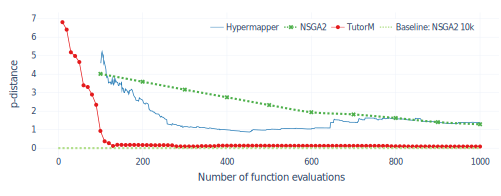{#fig:zdt6_dist width=100%}

It is evident that TutorM considerably outperforms NSGA2 and Hypermapper
2.0 right from the start of the optimization process. Our algorithm
quickly reaches optimal and stable results after 300 function
evaluations. As can be seen from another approach, Hypermapper began to
improve values confidently, but then deteriorated and matched with
NSGA2. The presented p-distance is measured from non-dominated solutions
(ndf size) that can be found in Figure {@fig:zdt6_ndf}.

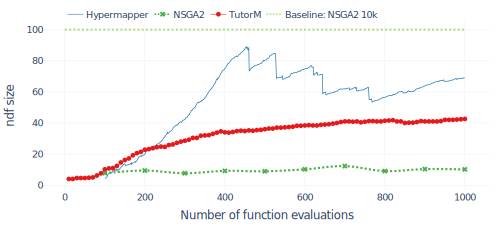{#fig:zdt6_ndf width=100%}

The count of solutions from TutorM grows evenly, reflecting the
stability of the search and the ascent to the real Pareto front. On the
contrary, Hypermapper has a serrated, unstable track that corresponds to
solutions that are stuck in local Pareto fronts. Repeated drops occur
upon the discovery of a new point in the other Pareto optimal fronts.

Figure {@fig:zdt6_models} shows that during the first six optimization
iterations, a sampling plan was used until a valid model appeared. This
suggests that, for a given problem with this surrogate portfolio, the 60
samples obtained from the sampling plan are enough to begin the
optimization process. As can be noted, for this problem and with this
portfolio, the most suitable compositional surrogate is a *Gradient
Boosting Regressor*.

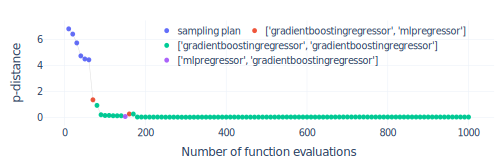{#fig:zdt6_models width=100%}

The final solution consists of non-dominant configurations that give an
idea of the Pareto front. In terms of overall Pareto front
approximations (Figure {@fig:zdt6_front})), only TutorM solutions
reach the baseline (NSGA2 10k) while other solutions are close and
distributed (Hypermapper) or far away and clustered (NSGA2).

{#fig:zdt6_front width=100%}

### Case studies: WFG1, WFG4, DTLZ4

Below, we compare how the optimization process varied across several
problems. The key feature of the method we developed is the dynamic
sampling plan, which depends on the quality of available surrogates. As
mentioned before, in Figure {@fig:zdt6_models}, when a static number
of random samples is estimated, it is possible to make optimal decisions
much earlier.

This approach is used in TutorM for all optimization problems. By
interpreting the end of the sampling plan and the availability of valid
models, we can estimate the cross-grain complexity of the unknown
problem. Figure {@fig:changing_models} shows a difference in the
adaptation of initial samples to problems (DTLZ4, WFG1) and a
corresponding improvement in hypervolume.

{#fig:changing_models width=100%}

In the case of WFG1, a valid model was quickly obtained and reduced the
initial sampling. This may indicate a convenient and unimodal
optimization landscape. On the contrary use-case of DTLZ4, the sampling
plan lasted longer and alternated with valid models. This may reflect
the complexity of the problem, such as the multimodality or bias of the
landscape. It should also be noted that in each case we considered, the
best surrogate model was different and might change during optimization.
Thus, for the case of DTLZ4, a clear advantage was observed in the
choice of composite surrogacy with *Gradient Boosting Regressor*,
whereas for WFG1, the multi-objective *Gaussian Process Regressor* was
the preferred choice.

In the next comparison, we look at WFG1 and WFG4. Figure {@fig:wfg1_ndf} {@fig:wfg1_front}
illustrates how the evaluation budget can be spent to find Pareto
optimal solutions. Let us look at the WFG1. It can be seen that TutorM
slowly increases the number of solutions during optimization
({@fig:wfg1_ndf}). Furthermore, the final result even exceeds the
solutions given by the NSGA2 after 10k function evaluations
({@fig:wfg1_front}). Turning now to Hypermapper, the non-dominated
plot is highly serrated, which indicates that the approach falls within
the local optima. Additional information is revealed in the final Figure
{@fig:wfg1_front}, which shows that most final Hypermapper solutions
are strongly clustered, reflecting a waste of resources.

For the WFG4 use-case, all approaches produce near-optimal solutions,
but only TutorM provides such an extensive set of near-optimal solutions
(non-dominated 400 solutions from 1000 function evaluations). This
property of TutorM means that the optimization process can stop earlier
and save on the evaluation budget.

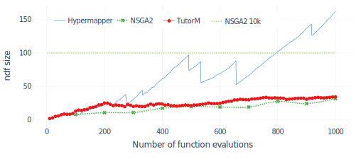{#fig:wfg1_ndf width=100%}

{#fig:wfg1_front width=100%}

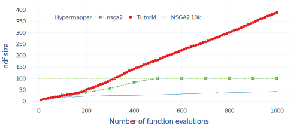{#fig:wfg4_ndf width=100%}

{#fig:wfg4_front width=100%}

### Results

For benchmark 1, we analyze 21 problems from three test sets. They have
2 or 3 parameters and 2 objectives. We repeat the experiments 5 times
and average them. We consider the following metrics:

-   **Hypervolume** This metric is calculated for each comparison
    because the hypervolume requires a single reference point for a
    group of competitors. Hypervolume metric is given as a percentage
    where $100\%$ corresponds to the maximum volume in the competition
    and $0\%$ corresponds to the hypervolume of a random set of
    solutions.

-   **p-distance** The primary metric for evaluation that corresponds to
    average distance to real Pareto front. Unfortunately, it is not
    available for WFG problems.

-   **Non-dominated font (ndf) size** The ratio of the number of final
    non-dominated decisions to the number of spent function evaluations.

-   **Spacing** The inverse spacing metric is calculated, where 1
    corresponds to the most cohesive decisions among competitors.

In following table (Table {@tbl:magic_five}), we present a subgroup of problems that
have varying complexity. The full list of results is provided in the appendix.

|            	|                 	| **ZDT4**     	| **ZDT6**   	| **DTLZ4**    	| **WFG1**   	| **WFG4**   	|
|------------	|-----------------	|----------	|--------	|----------	|--------	|--------	|
| TutorM     	| **Hypervolume** ↑   	| 99,80%   	| 99,43% 	| 99,83%   	| 95,75% 	| 99,28% 	|
|            	| **p-distance** ↓    	| 0,01     	| 0,09   	| 0,001    	| -      	| -      	|
|            	| **ndf-size** ↑      	| 50%      	| 4,26%  	| 0,2%     	| 3,44%  	| 38,9%  	|
|            	| **space-metric** ↑  	| 0,78     	| 0,17   	| 0,666    	| 0,51   	| 1      	|
| NSGA2      	| **Hypervolume** ↑   	| 83,43%   	| 83,84% 	| 87,81%   	| 30,52% 	| 83,95% 	|
|            	| **p-distance** ↓    	| 0,04     	| 1,29   	| 0,002    	| -      	| -      	|
|            	| **ndf-size** ↑      	| 8,77%    	| 1,01%  	| 9,600%   	| 3,18%  	| 10%    	|
|            	| **space-metric** ↑  	| 0,19     	| 0,04   	| 0,323    	| 0,28   	| 0,58   	|
| Hypermaper 2.0| **Hypervolume** ↑   	| 97,32%   	| 82,86% 	| 64,579%  	| 44,12% 	| 84,39% 	|
|            	| **p-distance** ↓    	| 0,9      	| 1,12   	| 0,059    	| -      	| -      	|
|            	| **ndf-size** ↑      	| 5,42%    	| 6,25%  	| 1,17%    	| 10,24% 	| 3,26%  	|
|            	| **space-metrics** ↑ 	| 0,11     	| 0,08   	| 0,029    	| 0,31   	| 0,06   	|
| NSGA2 50k  (Baseline) 	| **Hypervolume** ↑   	| 100%     	| 100%   	| 100%     	| 100%   	| 100%   	|
|                  	| **p-distance** ↓    	| 2,04e-05 	| 0,0003 	| 8,81e-06 	| -      	| -      	|
|            	| **ndf-size** ↑      	| 0,72%    	| 0,72%  	| 0,360%   	| 0,72%  	| 0,72%  	|
|            	| **space-metric** ↑  	| 1        	| 1      	| 1,000    	| 1      	| 0,6    	|

Table: Comparison of results after 1000 function evaluations.
{#tbl:magic_five}

To summarize, it follows from our results that our strategy generally
gives optimal or better results than the baseline on the majority of
investigated problems.

We assume that our positive results were due to the new features we
implemented, such as a surrogate model portfolio and adaptive sampling
plan. These features have yielded significant results on almost all
problems. However, we did not apply inner parameter tuning: in all
experiments, TutorM was used with default parameters.

Benchmark 2: Inner parameters
------------------------------

For the second benchmark, we investigated whether it is possible to
further improve the performance of TutorM by tuning its parameters. We
examine the effect of internal parameters on the performance and quality
of optimization. As was mentioned in the previous section, it was
applied with a default setting.

### TutorM parameters

Besides the standard model-based parameters, it is necessary to
investigate the impact of additional TutorM parameters such as
validation thresholds, test-set and prediction size. This research is
needed to select the configuration that can improve results of the
existing system. Unfortunately, there is insufficient information
available about how to configure model-based parameter optimization
[@hXsWZiMi; @n6umRRsz]. Filling this gap in knowledge will be
useful not only for the availability of TutorM but also for general
tuning of model-based optimization. Due to limited time, we consider
only the ZDT4 and ZDT6 problems using the surrogate portfolio from the
first benchmark, but without the *Gaussian regression model*. This model
takes a long time to train and the full factorial design did not fit
within our time frame. The following parameters are exposed in the
developed TutorM class:

-   **Initial dataset** \[`0`, 100, 500, 750\]. It is the initial number of
    points obtained from sampling plan. At the same time, the total
    budget for measurements remains unchanged and equals 1000. The
    default value is `0`.

-   **Surrogate validation.** Criteria and parameters for evaluating the
    usefulness of the surrogate model.

    -   **Train/test split** \[`75/25`, 90/10\] is a splitting proportion in
        which the samples available for training and testing are
        divided. Train and test sets are crucial to ensure that the
        surrogate model is able to generalize well to new data. The
        default value is `75/25`.

    -   **Cross-validation threshold**\[0.2, `0.65`, 0.9\] is a minimum
        accuracy threshold for any round in cross-validation(CV). CV is
        used to select valid surrogate models and avoid overfitting. The
        default values is `0.65`.

    -   **Test threshold** \[0, `0.6`, 0.9\] is a minimum accuracy threshold
        for the test set. The accuracy obtained from the test set and is
        used to verify the validity of models based on how they
        extrapolate unknown data. The default value is 0.6.

-   **Optimization search algorithm** \[NSGA2, `MOEA-Ctrl`\] optimization algorithm
    for multi-objective solutions. The default value is `MOEA-Ctrl`.

-   **Solution combinations** \[Non-dominated front score (ndf score),
    `Stacking` \] approach for choosing a set of solutions from a valid surrogate
    model. Since several models can be valid and each one provides its
    own set of decisions, we have a range of options. *Non-dominated
    front score (ndf score)* prefers the surrogate model with the
    highest precision for non-dominant solutions, whereas the *stack*
    integrates all available surrogate solutions into one set of
    solutions. The default value is `Stacking`.

-   **Prediction count** \[`10`, 100\] number of random solutions for the
    real evaluation that are selected from the set of solutions. The
    default value is `10`.

As a result of the full factorial design, 576 possible combinations were
obtained. Each combination was repeated five times and averaged.
Conclusions were made based on the 40 best and worst combinations.

First, we will consider the ZDT6 problem. Inspection of Figures
{@fig:zdt6_w} {@fig:zdt6_b} indicates that the *solution combination* made the
most significant impact on the result.

{#fig:zdt6_w width=100%} 

{#fig:zdt6_b width=100%}

There is a definite advantage in combining solutions into a stack. The
second most important parameter is the *Optimization search
algorithm*(Solver). The best configurations prefer to pick a combination
of Genetic Algorithms (MOEA-Ctrl) for optimization.

Let us look at the *solution combination* and the *Optimization search
algorithm* options in more detail (Figure {@fig:conf_zdt6_sign}).

{#fig:conf_zdt6_sign width=100%}

The impact of changing the algorithm is highly dependent on the solution
combination strategy. Improvement in results for MOEA-Ctrl is more
significant when the results are combined into a stack. This advantage
can be explained by the fact that the stack reduces the bias of
surrogate models while the combination of genetic algorithms decreases
prediction variance. Now we will look at the ZDT4 problem (Figure {@fig:zdt4_w} {@fig:zdt4_b}).

{#fig:zdt4_w width=100%}

{#fig:zdt4_b width=100%}

The results are similar to those obtained with the ZDT6 problem: the
solutions stack take part almost in all of the best configurations.
However, for this problem, there is no clear dominance of a single
algorithm. Yet, the validation thresholds have an impact on results
(Figure {@fig:conf_zdt4_sign}).

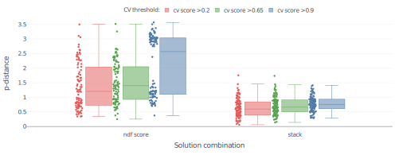{#fig:conf_zdt4_sign width=100%}

A significant difference is seen for the cross-validation threshold in
the case of *ndf score* *solution combination* set (Figure
{@fig:zdt4_w}). It should be noted that the stack makes the
validation threshold impact less significant, as evident from Figure
{@fig:conf_zdt4_sign}. This influence is related to this technique’s
ability to reduce the bias of solutions.

Another interesting conclusion can be made from the *initial sample
size*. The worst and the best configurations are most affected by tha
absence of a sampling plan. The reason for this is that the small number
of samples may lead to a surrogate model fallacy in extrapolation the
search space while, at the same time, the small number of samples
provide more opportunities for optimization search.

### Sampling plan size

The purpose of this experiment is to review the dependencies between the
optimization results and the sampling plan size. The Hypermapper was
selected as a foundation for analysis because it has a static
implementation of the optimization algorithm with the surrogate model.

The results are shown in the following Figure {@fig:hmapper_start_set}.

{#fig:hmapper_start_set width=100%}

For WFG problems, the criterion is hypervolume and for ZDT problems it
is p-distance. Of all the results, the initial sampling plan has the
smallest effect on the WFG4. Since this problem is unimodal, the model
requires fewer samples for extrapolation. Other problems have a more
complicated multimodal landscape that is shown by unstable results.

### Results

We investigated the parameters of TutorM and determined which ones
produce the best results. Also was noticed that *Solution combinations*
and *Optimization search algorithm* had the most significant impact on
solution quality. The *stack* of solutions with MOEA-Ctrl is the best
combination of parameters to use as a default for TutorM. The other
parameters tested have a much smaller effect.

Benchmark 3: Scalability of surrogate models
--------------------------------------------

Not only the type of the problem landscape but also its dimensions are
essential factors for picking a surrogate model. The advantage of a
surrogate model can be lost if the number of parameters or criteria is
changed. The goal of this experiment is to find out the scalability of
surrogate models.

The following surrogates were selected for evaluation:

-   *Gaussian Process Regressor* with kernel design from
    GPML[@1FXlw7TX2]. Gaussian process models are well-known and are
    commonly used in Bayesian optimization for a wide variety of
    problems [@iL724s1s; @mu8IFeYo].

-   *MLPRegressor* is a neural network implementation from the *sklearn*
    framework. Neural networks can automatically discover useful
    representations in high-dimensional data by learning multiple layers
    [@DjMKzd5z]. Because this model simultaneously extrapolates all
    objectives, we chose an architecture that consists of 5 layers and
    100 neurons per layer.

-   The surrogate portfolio includes Gradient Boosting Regressor,
    MLPRegressor, and *SVR (RBF kernel)*, as mentioned in
    Benchmark 2.

The DTLZ2 problem was selected to evaluate the scalability of the
surrogate models. It is an unimodal problem with multiple global optima
and concave geometry of the Pareto front. During experimentation with
DTLZ2, the number of optimization criteria changed with a constant
number of parameters. Figure {@fig:scale_dtlz2} shows the three
selected surrogate strategies with the average distance to the Pareto
front (first row) and time spent per optimization iteration (bottom
row). For all cases, the experiment was repeated five times.

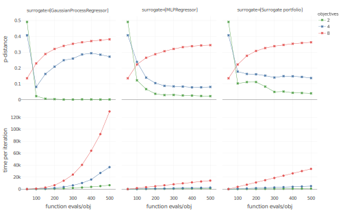{#fig:scale_dtlz2 width=100%}

As illustrated by Figure {@fig:scale_dtlz2}, *Gaussian Process
Regressor* model provides significantly better results relative to other
approaches, but only for the bi-objective problem. Increasing the number
of objectives to four leads to only the *MLPRegressor* and surrogate
portfolio converging on an optimal solution. Further increasing the
number of objectives makes the search space too complicated, and all
approaches fail to find solutions.

### Results

The ability of models to estimate the search space depends on their
hyperparameters. As an example: *Gaussian Process Regressor* are highly
dependent on the kernel while *MLPRegressor* depends on a number of
layers. In turn, for the surrogate portfolio, the parameters determine
how to *build and select* surrogate models. In the portfolio, a single
model with varying parameters is evaluated as a set of separate
entities. Thus, the scalability required to solve multi-dimensional
problems can be generated by surrogate portfolios.

Discussion of results
---------------------

The purpose of this thesis is to investigate the use of a cross-grained
compositional model for solving multi-objective problems. In this
evaluation section, we provided an extensive comparative analysis of the
performance of our and other techniques on a wide range of problems. The
analysis also included an exhaustive study of the possible parameters
and the impact of the sampling plan on results. The possibility of
scaling surrogate models by increasing the number of objectives was also
tested.

We draw the following conclusions from our evaluation experiments:

1.  TutorM is far ahead of its counterparts (Hypermapper 2.0 and NSGA2)
    and achieves optimal results while sparing function evaluations.

2.  Parameter analysis for TutorM shows that results are significantly
    improved by combining solutions with multiple surrogates (solution
    stack).

3.  When the possibility of scaling up the surrogate portfolio was
    tested, we determine that dynamically selecting an appropriate
    surrogate model for the specific dimensionality of the problem is
    essential.

[^1]: [scikit-learn.org]{}: sklearn.gaussianprocess.GaussianProcessRegressor

[^2]: [scikit-learn.org]{}: sklearn.svm.SVR

[^3]: [scikit-learn.org]{}: sklearn.neural network.MLPRegressor

[^4]: [scikit-learn.org]{}: sklearn.ensemble.GradientBoostingRegressor

Conclusion
==========

In this thesis, we propose a strategy for dynamic composition of
surrogate models which allows the use of a surrogate portfolio for
tuning black-box functions. Our investigation revealed that current
surrogate-based optimization operates with a single type of model or the
static combination of several varieties. This type of approach lacks
variability and cannot be adapted for arbitrary problems. Our research
goal was to decompose model-based multi-objective optimization into
reusable and comparable components. To achieve this goal we make
following research contributions:

1.  First, we developed a compositional model for an arbitrary type of
    surrogate model. We established and implemented a component that
    combined several models into one surrogate hypothesis \[**RG1**\].
    Nevertheless, for an arbitrary, unknown problem, we still require
    dynamic integration of surrogates into a composite model.

2.  Second, we adapted the cross-validation technique to validate and
    compare surrogate models. A multi-step validation is essential to
    avoid the model underfeed and overfeed. Validation information
    enables us to dynamically decide on picking the right models or use
    the sampling plan as a default variant \[**RG3**\].

3.  Third, we implemented a surrogate portfolio that combines the
    functionality from the preceding paragraphs. The portfolio allows
    the dynamic selection and combination of multiple surrogate models
    that are concerned with a concrete problem. This property means that
    a portfolio can offer more than one surrogate hypothesis for
    optimization \[**RG2**\].

4.  Fourth, we improved the variability and extensibility not only of
    surrogate models but also of optimization algorithms. This
    improvement creates the possibility to combine solutions into a
    stack to reduce overall error.

In sum, these contributions enabled us to achieve results comparable to
the state-of-the-art NSGA2 optimization algorithm in a wide range of
optimization tasks. For almost all problems, our approach has
demonstrated a significant advantage over all solution criteria.
Analysis of the parameters showed that the most significant influence on
results was made by solution combination (assumptions about the Pareto
front). We have implemented a dynamic sampling plan that selects
additional random points if there is no valid model. This strategy
improved exploration-exploitation balance, which is determined for each
optimization problem independently, and that led to the overall
improvements in the results. The next crucial issue that we addressed is
the optimization of multidimensional space. We have shown that a
surrogate model can be applied to a small number of objectives but can
be inappropriate if the objectives are multiplied. The optimal solution
for this issue is a flexible combination of better models at each
optimization iteration.

We consider that the results accomplished in this thesis can be useful
for improving parameter tuning and for overall model-based optimization.

Future Work 
===========

In this thesis we have developed the strategy that has a component
structure and a unified interface. All major components are easily
replaceable and scalable. A strong feature of our solution is the
adaptation of optimization to a scaled unknown problem. That is why
further integration with the *software product line* is a promising
improvement. The right solution for this is - a software product line
for parameter tuning. It has the necessary key features such as stop
condition, noisy experiments and distributed architecture. The
integration of this thesis into BRISE will improve its variability and
scalability.

There are other several directions that we aim to focus on in the
future.

-   Promising results have been obtained for the combination of
    optimization techniques with surrogate modes. Further investigation
    in extensive parallel combination of *surrogate models and
    optimization algorithms* could significantly improve optimization
    results.

-   It is advisable to change the composition of the portfolio to
    discard those models that are performing poorly. This *dynamic model
    collection* for the surrogate portfolio could improve the
    exploration of new models and reduce time costs.

Appendix {.page_break_before}
==========

| **Problem** 	| **Approach**    	| ↓ **p-distance** 	| ↑ **Hypervolume** \% 	| ↑ **ndf size** \% 	| ↑  **ndf space** 	|
|-------------	|-----------------	|------------------	|----------------------	|-------------------	|------------------	|
| ZDT1        	| Baseline        	| 1,08e-05         	| 99,78                	| 0,16              	| 0,22             	|
|             	| TutorM          	| **4,74e-05**     	| **100**              	| **90,33**         	| **1**            	|
|             	| NSGA2 1k        	| 0,02             	| 89,86                	| 9,66              	| 0,08             	|
|             	| Hypermapper 2.0 	| 0,12             	| 98,93                	| 10,36             	| 0,04             	|
| ZDT2        	| Baseline        	| 1,04e-14         	| 99,79                	| 0,16              	| 0,29             	|
|             	| TutorM          	| **0,00013**      	| **100**              	| **86,87**         	| **1**            	|
|             	| NSGA2 1k        	| 0,01             	| 88,78                	| 8,82              	| 0,06             	|
|             	| Hypermapper 2.0 	| 0,18             	| 97,31                	| 5,12              	| 0,04             	|
| ZDT3        	| Baseline        	| 1,69e-08         	| 100                  	| 0,16              	| 0,39             	|
|             	| TutorM          	| **0,00012**      	| **99,47**            	| **86**            	| **1**            	|
|             	| NSGA2 1k        	| 0,02             	| 89,92                	| 9,82              	| 0,28             	|
|             	| Hypermapper 2.0 	| 0,31             	| 92,03                	| 5,64              	| 0,12             	|
| ZDT4        	| Baseline        	| 2,04e-05         	| 100                  	| 0,72              	| 1                	|
|             	| TutorM          	| **0,01**         	| **99,80**            	| **50**            	| **0,78**         	|
|             	| NSGA2 1k        	| 0,04             	| 83,43                	| 8,77              	| 0,19             	|
|             	| Hypermapper 2.0 	| 0,90             	| 97,32                	| 5,42              	| 0,11             	|
| ZDT6        	| Baseline        	| 0,0003           	| 100                  	| 0,72              	| 1                	|
|             	| TutorM          	| **0,09**         	| **99,43**            	| 4,26              	| 0,17             	|
|             	| Hypermapper 2.0 	| 1,12             	| 82,86                	| **6,25**          	| 0,08             	|
|             	| NSGA2 1k        	| 1,29             	| 83,84                	| 1,01              	| 0,04             	|

Table: Results of 5 repetitions for ZDT problem set: Function evaluation budget is 1000. The baseline is the NSGA2 with 50000 evaluations (100 population size in 500 generations)
{#tbl:ZDT}

| **Problem** 	| **Approach**    	| ↓ **p-distance** 	| ↑ **Hypervolume** \% 	| ↑ **ndf size**\% 	| ↑  **ndf space** 	|
|-------------	|-----------------	|------------------	|----------------------	|------------------	|------------------	|
| DTLZ1       	| Baseline        	| 0,800            	| 100                  	| 0,24             	| 1                	|
|             	| NSGA2 1k        	| **3,277**        	| 56,577               	| **1,56**         	| 0,046            	|
|             	| TutorM          	| 51,611           	| **98,163**           	| 0,54             	| 0,058            	|
|             	| Hypermapper 2.0 	| 74,251           	| 86,173               	| 0,78             	| 0,049            	|
| DTLZ2       	| Baseline        	| 5,19e-06         	| 98,603               	| 0,24             	| 0,39             	|
|             	| TutorM          	| **0,0004**       	| **100**              	| **82,56**        	| 1                	|
|             	| NSGA2 1k        	| 0,003            	| 80,415               	| 10               	| 0,301            	|
|             	| Hypermapper 2.0 	| 0,058            	| 76,103               	| 2,84             	| 0,063            	|
| DTLZ3       	| Baseline        	| 0,4              	| 100                  	| 0,24             	| 1                	|
|             	| NSGA2 1k        	| **4,430**        	| 74,937               	| 0,82             	| 0,037            	|
|             	| TutorM          	| 38,735           	| **97,743**           	| 0,40             	| 0,045            	|
|             	| Hypermapper 2.0 	| 92,228           	| 95,010               	| 0,70             	| 0,047            	|
| DTLZ4       	| Baseline        	| 8,81e-06         	| 100                  	| 0,36             	| 1                	|
|             	| TutorM          	| **0,001**        	| **99,829**           	| **30,68**        	| 0,666            	|
|             	| NSGA2 1k        	| 0,002            	| 87,807               	| 9,60             	| 0,323            	|
|             	| Hypermapper 2.0 	| 0,059            	| 64,579               	| 1,18             	| 0,029            	|
| DTLZ5       	| Baseline        	| 1,62e-05         	| 98,631               	| 0,24             	| 0,486            	|
|             	| TutorM          	| **0,0004**       	| **100**              	| **80,88**        	| 1                	|
|             	| NSGA2 1k        	| 0,002            	| 81,729               	| 10               	| 0,434            	|
|             	| Hypermapper 2.0 	| 0,058            	| 78,463               	| 3,02             	| 0,06             	|
| DTLZ6       	| Baseline        	| 0,009            	| 100                  	| 0,24             	| 1                	|
|             	| TutorM          	| **0,123**       	| **98,064**           	| 3,70             	| 0,142            	|
|             	| NSGA2 1k        	| 1,011            	| 54,258               	| 2,88             	| 0,128            	|
|             	| Hypermapper 2.0 	| 1,657            	| 18,355               	| 2,22             	| 0,084            	|
| DTLZ7       	| Baseline        	| 2,42e-07         	| 99,938               	| 0,24             	| 0,364            	|
|             	| TutorM          	| **0,0003**       	| **100**              	| **87**           	| 1                	|
|             	| NSGA2 1k        	| 0,160            	| 92,891               	| 3,04             	| 0,128            	|
|             	| Hypermapper 2.0 	| 0,781            	| 91,129               	| 2,24             	| 0,081            	|

Table: Results of 5 repetitions for DTLZ problem set: Function evaluation budget is 1000. The baseline is the NSGA2 with 50000 evaluations (100 population size in 500 generations)
{#tbl:DTLZ}

| **Problem** 	| **Approach**    	| ↓ **Hypervolume** \% 	| ↑ **ndf size** \% 	| ↑  **ndf space** 	|
|-------------	|-----------------	|----------------------	|-------------------	|------------------	|
| WFG1        	| Baseline        	| 100                  	| 0,72              	| 1                	|
|             	| TutorM          	| **95,75**            	| 3,44              	| **0,51**         	|
|             	| Hypermapper 2.0 	| 44,12                	| **10,24**         	| 0,31             	|
|             	| NSGA2 1k        	| 30,52                	| 3,18              	| 0,28             	|
| WFG2        	| Baseline        	| 100                  	| 0,08              	| 0,63             	|
|             	| TutorM          	| **98,64**            	| **29,22**         	| **1**            	|
|             	| NSGA2 1k        	| 85,96                	| 6,44              	| 0,35             	|
|             	| Hypermapper 2.0 	| 62,35                	| 1,20              	| 0,10             	|
| WFG3        	| TutorM          	| **100**              	| **55,5**          	| **1**            	|
|             	| Baseline        	| 99,05                	| 0,08              	| 0,29             	|
|             	| NSGA2 1k        	| 84,46                	| 9,72              	| 0,15             	|
|             	| Hypermapper 2.0 	| 73,31                	| 2,44              	| 0,02             	|
| WFG4        	| Baseline        	| 100                  	| 0,72              	| 0,60             	|
|             	| TutorM          	| **99,28**            	| **38,90**         	| **1**            	|
|             	| Hypermapper 2.0 	| 84,39                	| 3,26              	| 0,06             	|
|             	| NSGA2 1k        	| 83,95                	| 10                	| 0,58             	|
| WFG5        	| Baseline        	| 100                  	| 0,20              	| 0,24             	|
|             	| TutorM          	| **98,01**            	| **87,60**         	| **1**            	|
|             	| Hypermapper 2.0 	| 84,83                	| 34,74             	| 0,06             	|
|             	| NSGA2 1k        	| 82,70                	| 10,00             	| 0,18             	|
| WFG6        	| TutorM          	| **100**              	| **52,68**         	| **1**            	|
|             	| Baseline        	| 99,30                	| 0,20              	| 0,33             	|
|             	| NSGA2 1k        	| 86,59                	| 10                	| 0,27             	|
|             	| Hypermapper 2.0 	| 83,21                	| 2,36              	| 0,03             	|
| WFG7        	| TutorM          	| **100**              	| **46,30**         	| **1**            	|
|             	| Baseline        	| 99,30                	| 0,20              	| 0,33             	|
|             	| NSGA2 1k        	| 86,39                	| 10                	| 0,26             	|
|             	| Hypermapper 2.0 	| 83,14                	| 2,36              	| 0,04             	|
| WFG8        	| Baseline        	| 100                  	| 0,20              	| 1                	|
|             	| TutorM          	| **95,24**            	| **20,70**         	| **0,26**         	|
|             	| Hypermapper 2.0 	| 86,74                	| 2,80              	| 0,07             	|
|             	| NSGA2 1k        	| 79,63                	| 9,54              	| 0,20             	|
| WFG9        	| Baseline        	| 100                  	| 0,20              	| 0,85             	|
|             	| TutorM          	| **92,17**            	| **12,92**         	| **0,63**         	|
|             	| Hypermapper 2.0 	| 80,80                	| 7,30              	| 0,24             	|
|             	| NSGA2 1k        	| 73,56                	| 10                	| 1                	|

Table: Results of 5 repetitions for WFG problem set: Function evaluation budget is 1000. The baseline is the NSGA2 with 50000 evaluations (100 population size in 500 generations)
{#tbl:WFG}

## References {.page_break_before}

<!-- Explicitly insert bibliography here -->

